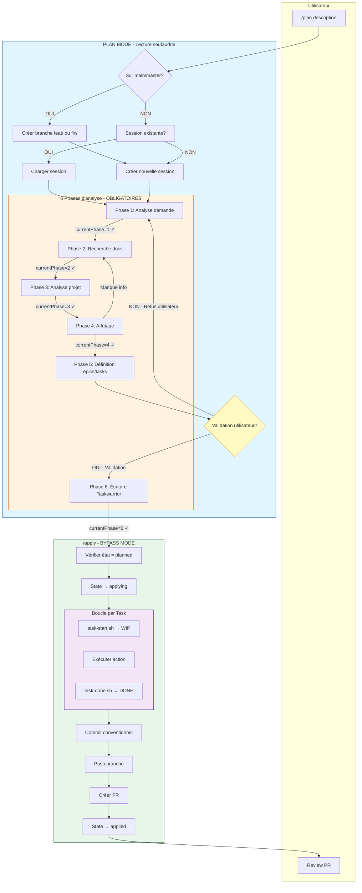
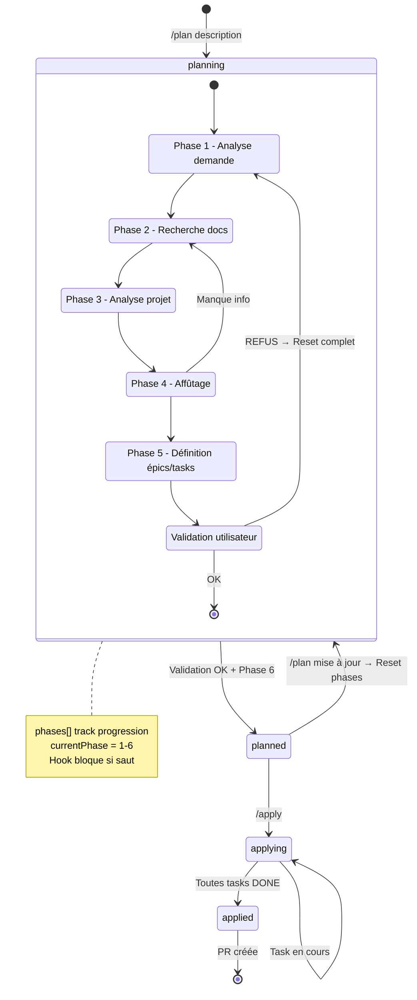
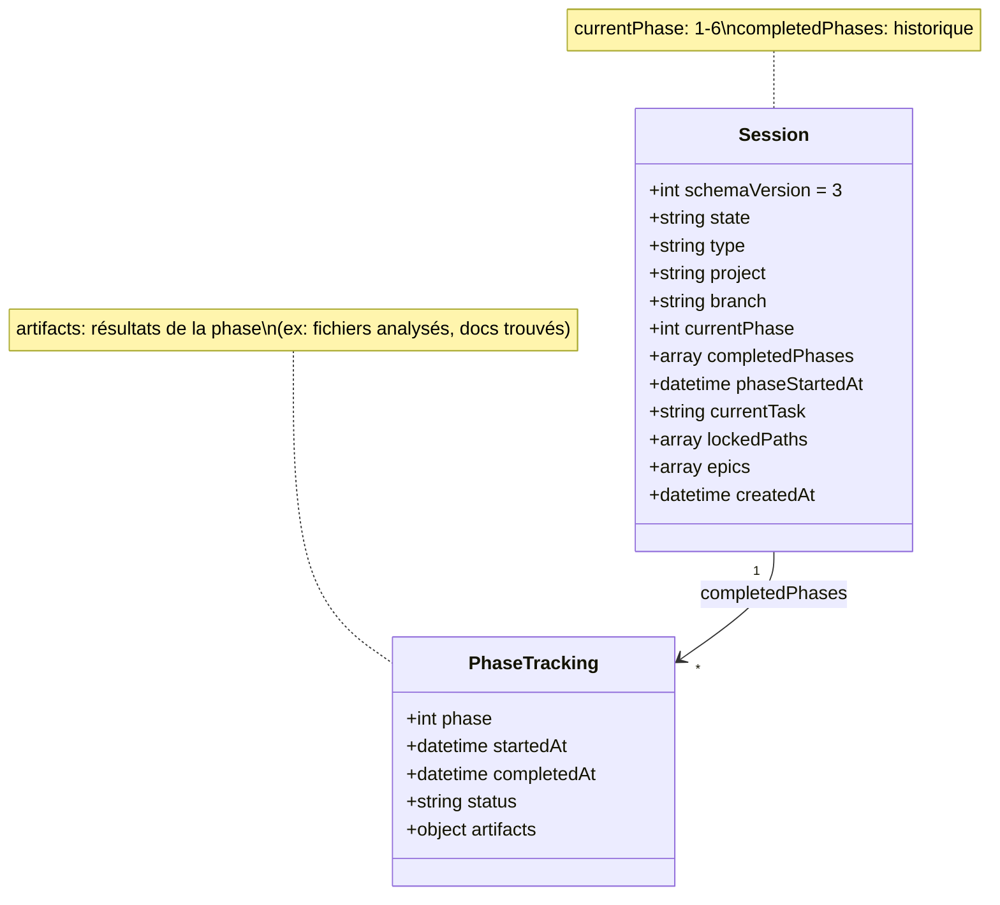
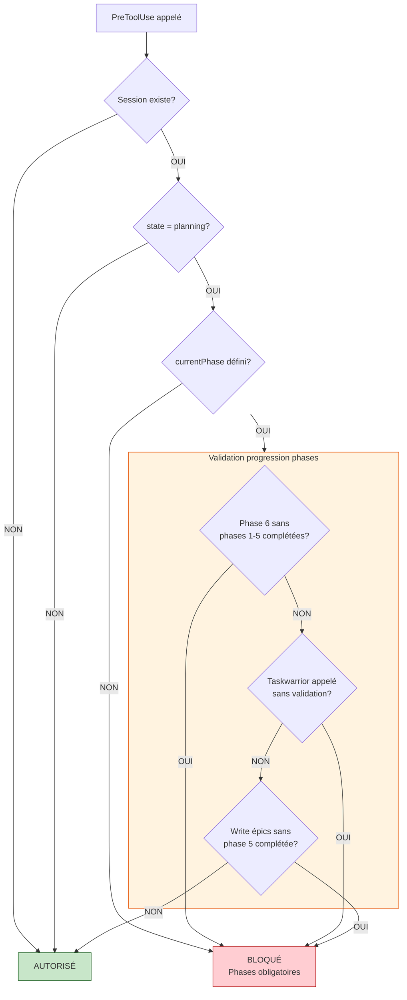
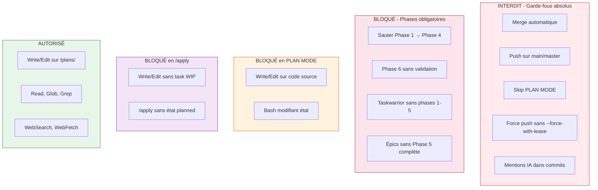
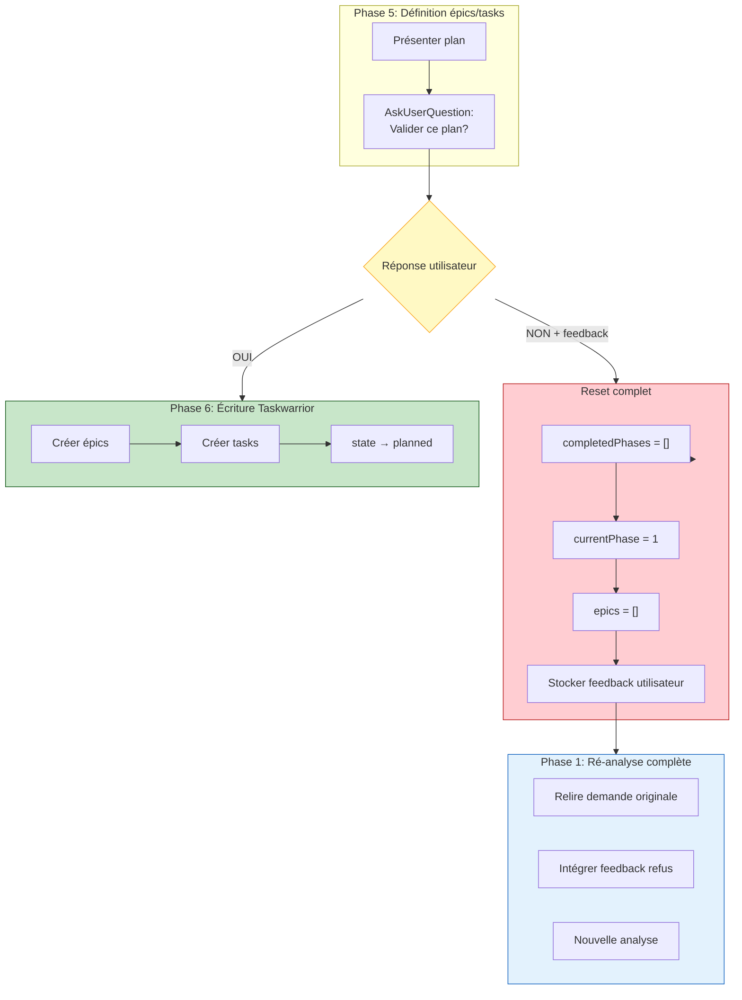
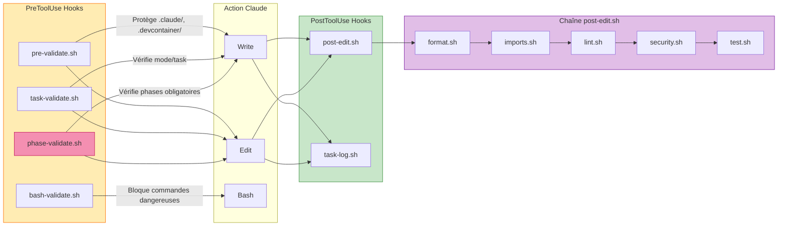
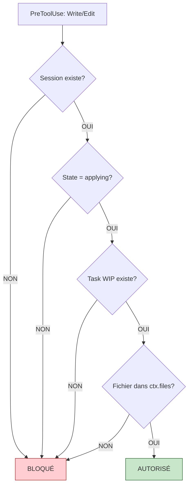
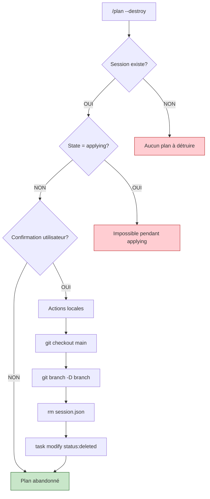
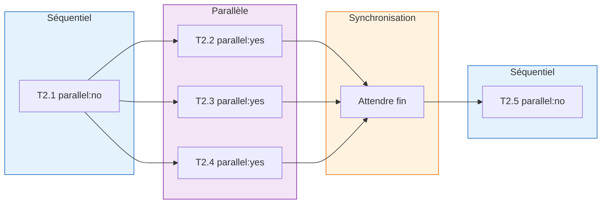

# Workflow /plan & /apply - Visualisation

Ce document présente les diagrammes de flux pour les commandes `/plan` et `/apply` du DevContainer.

## Vue d'ensemble du workflow



---

## Machine d'états avec phases



---

## Tracking des phases (Session JSON v3)



**Nouveau schéma session v3 :**

```json
{
  "schemaVersion": 3,
  "state": "planning",
  "type": "feature",
  "project": "my-feature",
  "branch": "feat/my-feature",
  "currentPhase": 2,
  "completedPhases": [
    {
      "phase": 1,
      "startedAt": "2024-01-01T10:00:00Z",
      "completedAt": "2024-01-01T10:05:00Z",
      "status": "completed",
      "artifacts": {
        "requirements": ["auth system", "JWT tokens"],
        "constraints": ["no breaking changes"]
      }
    }
  ],
  "phaseStartedAt": "2024-01-01T10:05:00Z",
  "epics": [],
  "createdAt": "2024-01-01T10:00:00Z"
}
```

---

## Hook phase-validate.sh



---

## Contraintes et Garde-fous



---

## Flow refus utilisateur



---

## Flow des Hooks



---

## Détail task-validate.sh



---

## Flow /plan --destroy



---

## Exécution parallèle des tasks



---

## Légende des couleurs

| Couleur | Signification |
|---------|---------------|
| Bleu clair | PLAN MODE - Lecture seule |
| Vert clair | BYPASS MODE / Autorisé |
| Orange | Phases / Hooks PreToolUse |
| Violet | Parallélisme / PostToolUse |
| Rose | Phases obligatoires |
| Jaune | Point de décision critique |
| Rouge clair | Bloqué / Interdit |

---

## Résumé des changements v3

| Avant | Après |
|-------|-------|
| Refus → retour Phase 5 | Refus → **Reset Phase 1** |
| Pas de tracking phases | `currentPhase` + `completedPhases` |
| Saut de phases possible | **Hook phase-validate.sh** bloque |
| Taskwarrior sans validation | **BLOQUÉ** par hook |

---

## Extension VSCode recommandée

Pour visualiser les diagrammes Mermaid directement dans VSCode, installez :

### Markdown Preview Mermaid Support

- ID: `bierner.markdown-mermaid`
- [Marketplace](https://marketplace.visualstudio.com/items?itemName=bierner.markdown-mermaid)

```bash
code --install-extension bierner.markdown-mermaid
```

Ou via la palette de commandes : `Ctrl+Shift+X` → chercher "mermaid"
