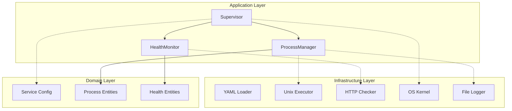

# superviz.io Documentation

PID1-capable process supervisor for containers and Unix systems.

## Table of Contents

| Document | Description |
|----------|-------------|
| [Architecture](architecture.md) | Hexagonal architecture, layers, dependencies |
| [Components](components.md) | Detailed component documentation |
| [Flows](flows.md) | Process lifecycle, health checks, signal handling |
| [Configuration](configuration.md) | YAML configuration reference |
| [Development](development.md) | Development setup, testing, contributing |

## Quick Overview

```
┌─────────────────────────────────────────────────────────────────┐
│                         superviz.io                              │
│                                                                  │
│   A process supervisor that can:                                │
│   • Run as PID 1 in containers (zombie reaping)                 │
│   • Manage multiple services with dependencies                   │
│   • Monitor health via HTTP, TCP, or commands                   │
│   • Restart services with exponential backoff                   │
│   • Rotate logs by size, age, or count                          │
│   • Forward signals to child processes                          │
│                                                                  │
└─────────────────────────────────────────────────────────────────┘
```

## Architecture at a Glance



## Key Features

### Multi-Service Management

```yaml
services:
  - name: api
    command: /app/api-server
    restart:
      policy: always

  - name: worker
    command: /app/worker
    depends_on:
      - api
```

### Health Monitoring

```yaml
health_checks:
  - type: http
    endpoint: http://localhost:8080/health
    interval: 30s
    timeout: 5s
```

### Log Rotation

```yaml
logging:
  stdout:
    file: app.log
    rotation:
      max_size: 100MB
      max_files: 5
      compress: true
```

## Getting Started

1. **Install**: Download from [releases](https://github.com/supervizio/daemon/releases)
2. **Configure**: Create `config.yaml` (see [Configuration](configuration.md))
3. **Run**: `supervizio --config config.yaml`

## License

MIT - See [LICENSE](../LICENSE)
