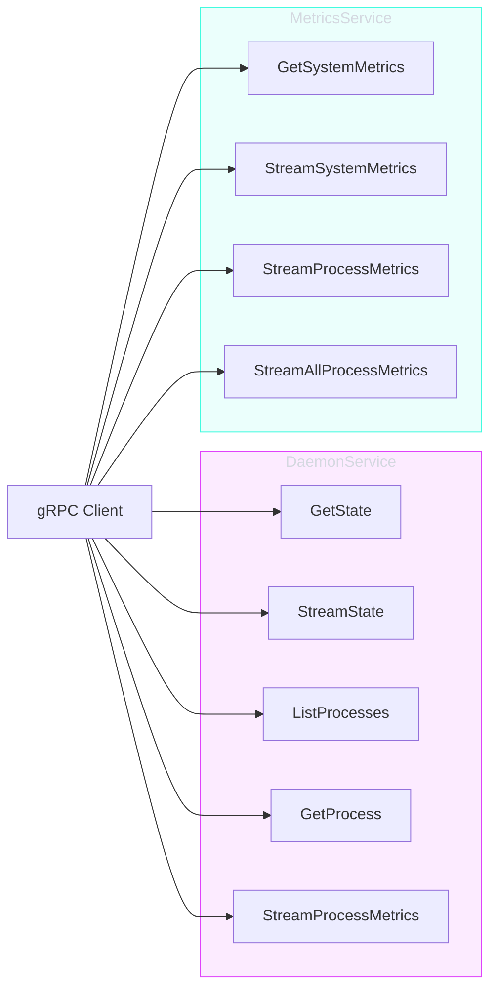

# API Reference

superviz.io exposes a gRPC API for remote daemon control and metrics streaming. The API is defined in Protocol Buffers and supports both unary and server-side streaming RPCs.

---

## Services

| Service | Package | Description |
|---------|---------|-------------|
| [`DaemonService`](daemon-service.md) | `daemon.v1` | Daemon state and process management |
| [`MetricsService`](metrics-service.md) | `daemon.v1` | System and process metrics streaming |
| `Health` | `grpc.health.v1` | Standard gRPC health checking |

---

## Connection

Default listen address: `:50051`

```bash
# Using grpcurl
grpcurl -plaintext localhost:50051 daemon.v1.DaemonService/GetState
grpcurl -plaintext localhost:50051 daemon.v1.MetricsService/GetSystemMetrics

# Health check
grpcurl -plaintext localhost:50051 grpc.health.v1.Health/Check
```

---

## RPC Overview



---

## Streaming

All streaming RPCs use server-side streaming. The client sends a single request with an optional `interval` field (default: 5 seconds), and the server pushes updates at that interval.

- First response is sent immediately
- Subsequent responses sent on a regular tick
- Client cancellation (context cancel) terminates the stream
- Server graceful shutdown closes all active streams

---

## Health Check Registration

The gRPC server registers health status for:

| Service Name | Description |
|-------------|-------------|
| `""` (empty) | Server-level global health |
| `daemon.v1.DaemonService` | Daemon service health |
| `daemon.v1.MetricsService` | Metrics service health |

---

## Protobuf Definition

Source: [`src/api/proto/v1/daemon/daemon.proto`](https://github.com/supervizio/daemon/blob/main/src/api/proto/v1/daemon/daemon.proto)

Code generation:

```bash
protoc --go_out=. --go_opt=paths=source_relative \
       --go-grpc_out=. --go-grpc_opt=paths=source_relative \
       v1/daemon/daemon.proto
```
