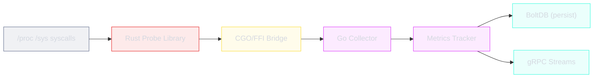

# MetricsService

The `MetricsService` provides system-wide and per-process metrics streaming via gRPC.

```protobuf
service MetricsService {
    rpc GetSystemMetrics(google.protobuf.Empty) returns (SystemMetrics);
    rpc StreamSystemMetrics(StreamMetricsRequest) returns (stream SystemMetrics);
    rpc StreamProcessMetrics(StreamProcessMetricsRequest) returns (stream ProcessMetrics);
    rpc StreamAllProcessMetrics(StreamMetricsRequest) returns (stream ProcessMetrics);
}
```

---

## RPCs

### GetSystemMetrics

Returns current system-wide CPU, memory, and load average metrics.

**Request**: `google.protobuf.Empty`

**Response**: `SystemMetrics`

```bash
grpcurl -plaintext localhost:50051 daemon.v1.MetricsService/GetSystemMetrics
```

### StreamSystemMetrics

Streams system metrics at a configurable interval.

**Request**: `StreamMetricsRequest`

| Field | Type | Description |
|-------|------|-------------|
| `interval` | `Duration` | Interval between snapshots (default: 5s) |

**Response**: `stream SystemMetrics`

### StreamProcessMetrics

Streams metrics for a specific process.

**Request**: `StreamProcessMetricsRequest`

| Field | Type | Description |
|-------|------|-------------|
| `service_name` | `string` | Service name to stream |
| `interval` | `Duration` | Interval between snapshots (default: 5s) |

**Response**: `stream ProcessMetrics`

### StreamAllProcessMetrics

Streams metrics for all supervised processes. Each message in the stream contains metrics for one process; all processes are sent in each interval cycle.

**Request**: `StreamMetricsRequest`

| Field | Type | Description |
|-------|------|-------------|
| `interval` | `Duration` | Interval between snapshots (default: 5s) |

**Response**: `stream ProcessMetrics`

---

## Message Types

### SystemMetrics

| Field | Type | Description |
|-------|------|-------------|
| `cpu` | `SystemCPU` | System CPU metrics |
| `memory` | `SystemMemory` | System memory metrics |
| `load` | `LoadAverage` | System load average |
| `timestamp` | `Timestamp` | Collection timestamp |

### SystemCPU

| Field | Type | Description |
|-------|------|-------------|
| `user_ns` | `uint64` | User mode time (ns) |
| `nice_ns` | `uint64` | Nice time (ns) |
| `system_ns` | `uint64` | System mode time (ns) |
| `idle_ns` | `uint64` | Idle time (ns) |
| `iowait_ns` | `uint64` | I/O wait time (ns) |
| `irq_ns` | `uint64` | IRQ time (ns) |
| `softirq_ns` | `uint64` | Soft IRQ time (ns) |
| `steal_ns` | `uint64` | Steal time (ns) |
| `usage_percent` | `double` | Overall CPU usage % |

### SystemMemory

| Field | Type | Description |
|-------|------|-------------|
| `total_bytes` | `uint64` | Total memory |
| `available_bytes` | `uint64` | Available memory |
| `used_bytes` | `uint64` | Used memory |
| `free_bytes` | `uint64` | Free memory |
| `buffers_bytes` | `uint64` | Buffer memory |
| `cached_bytes` | `uint64` | Cached memory |
| `shared_bytes` | `uint64` | Shared memory |
| `swap_total_bytes` | `uint64` | Total swap |
| `swap_used_bytes` | `uint64` | Used swap |
| `swap_free_bytes` | `uint64` | Free swap |
| `usage_percent` | `double` | Memory usage % |

### LoadAverage

| Field | Type | Description |
|-------|------|-------------|
| `load1` | `double` | 1-minute load average |
| `load5` | `double` | 5-minute load average |
| `load15` | `double` | 15-minute load average |

---

## Metrics Pipeline

The metrics pipeline flows from OS-level data through the Rust FFI probe to gRPC streams:


