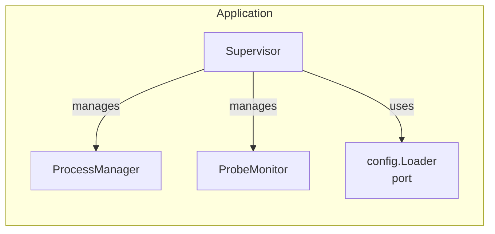
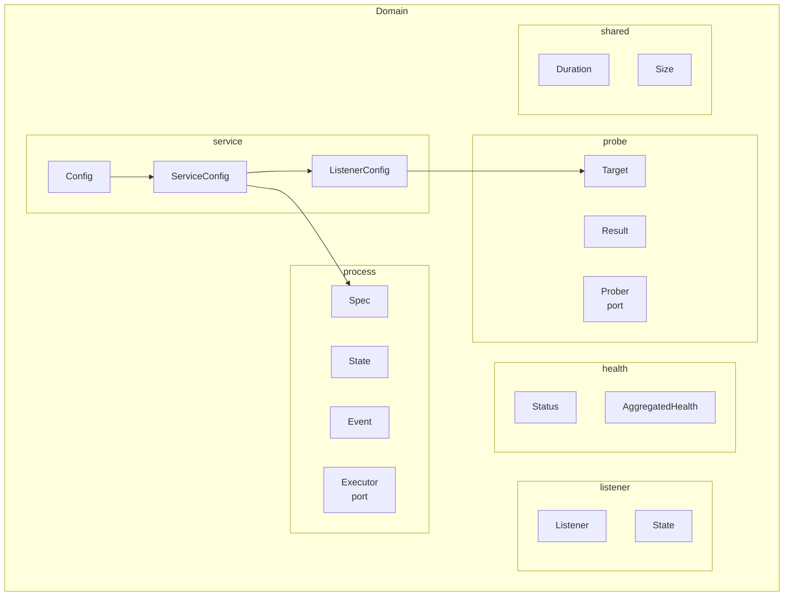
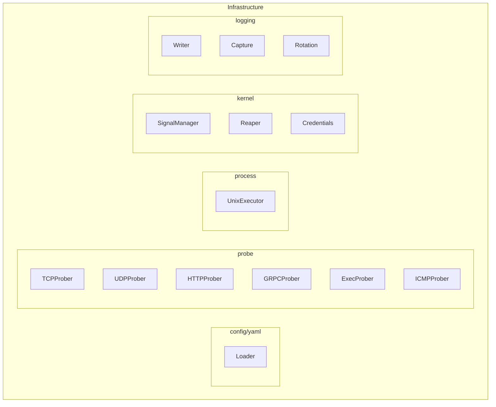
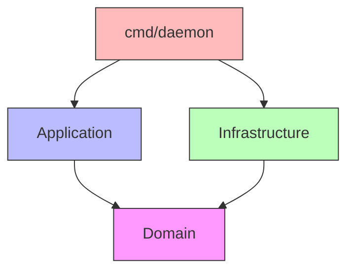

# Architecture

superviz.io is built using **Hexagonal Architecture** (also known as Ports & Adapters), ensuring clean separation of concerns and testability.

## Hexagonal Architecture Overview

```
┌─────────────────────────────────────────────────────────────────────────┐
│                                                                          │
│                           EXTERNAL WORLD                                 │
│                                                                          │
│    ┌──────────┐  ┌──────────┐  ┌──────────┐  ┌──────────┐              │
│    │   CLI    │  │   YAML   │  │    OS    │  │   File   │              │
│    │  (main)  │  │  Files   │  │ Signals  │  │  System  │              │
│    └────┬─────┘  └────┬─────┘  └────┬─────┘  └────┬─────┘              │
│         │             │             │             │                      │
│    ═════╪═════════════╪═════════════╪═════════════╪══════════════════   │
│         │             │             │             │                      │
│         │      ┌──────┴─────────────┴─────────────┴──────┐              │
│         │      │           INFRASTRUCTURE                 │              │
│         │      │                                          │              │
│         │      │  ┌─────────────┐  ┌─────────────┐       │              │
│         │      │  │ config/yaml │  │   kernel    │       │              │
│         │      │  │   Loader    │  │  Signals    │       │              │
│         │      │  └─────────────┘  │  Reaper     │       │              │
│         │      │                    │  Credentials│       │              │
│         │      │  ┌─────────────┐  └─────────────┘       │              │
│         │      │  │   probe     │                         │              │
│         │      │  │  TCP/UDP    │  ┌─────────────┐       │              │
│         │      │  │  HTTP/gRPC  │  │   logging   │       │              │
│         │      │  │  Exec/ICMP  │  │   Writers   │       │              │
│         │      │  └─────────────┘  │   Rotation  │       │              │
│         │      │                    └─────────────┘       │              │
│         │      │  ┌─────────────┐                         │              │
│         │      │  │   process   │                         │              │
│         │      │  │  Executor   │                         │              │
│         │      │  └─────────────┘                         │              │
│         │      └──────────────────────────────────────────┘              │
│         │                          │                                     │
│         │                          │ implements                          │
│         │                          ▼                                     │
│         │      ┌──────────────────────────────────────────┐              │
│         │      │              DOMAIN                       │              │
│         │      │                                           │              │
│         │      │  ┌─────────┐ ┌─────────┐ ┌─────────┐    │              │
│         │      │  │ service │ │ process │ │  probe  │    │              │
│         │      │  │ Config  │ │  Spec   │ │ Target  │    │              │
│         │      │  │Listeners│ │  State  │ │ Result  │    │              │
│         │      │  │         │ │ Executor│ │ Prober  │    │              │
│         │      │  │         │ │  (port) │ │  (port) │    │              │
│         │      │  └─────────┘ └─────────┘ └─────────┘    │              │
│         │      │                                           │              │
│         │      │  ┌─────────┐ ┌─────────┐                 │              │
│         │      │  │listener │ │ health  │                 │              │
│         │      │  │Listener │ │ Status  │                 │              │
│         │      │  │  State  │ │Aggregated                 │              │
│         │      │  └─────────┘ └─────────┘                 │              │
│         │      │                                           │              │
│         │      │  ┌─────────────────────────────────┐     │              │
│         │      │  │             shared              │     │              │
│         │      │  │   Duration    Size    Errors    │     │              │
│         │      │  └─────────────────────────────────┘     │              │
│         │      └──────────────────────────────────────────┘              │
│         │                          ▲                                     │
│         │                          │ uses                                │
│         │                          │                                     │
│         │      ┌──────────────────────────────────────────┐              │
│         └─────▶│            APPLICATION                    │              │
│                │                                           │              │
│                │  ┌───────────────────────────────────┐   │              │
│                │  │           Supervisor              │   │              │
│                │  │   • Orchestrates all services     │   │              │
│                │  │   • Handles signals               │   │              │
│                │  │   • Manages lifecycle             │   │              │
│                │  └───────────────────────────────────┘   │              │
│                │                    │                      │              │
│                │         ┌──────────┴──────────┐          │              │
│                │         ▼                     ▼          │              │
│                │  ┌─────────────┐      ┌─────────────┐   │              │
│                │  │ProcessManager│     │ ProbeMonitor│   │              │
│                │  │             │      │             │   │              │
│                │  │ • Start/Stop│      │ • Schedule  │   │              │
│                │  │ • Restart   │      │ • Probes    │   │              │
│                │  │ • Monitor   │      │ • Aggregate │   │              │
│                │  └─────────────┘      └─────────────┘   │              │
│                │                                           │              │
│                │  ┌─────────────────────────────────┐     │              │
│                │  │        config (ports)           │     │              │
│                │  │   Loader    Reloader            │     │              │
│                │  └─────────────────────────────────┘     │              │
│                └──────────────────────────────────────────┘              │
│                                                                          │
└─────────────────────────────────────────────────────────────────────────┘
```

## Layer Responsibilities

### Application Layer (`internal/application/`)

**Purpose**: Orchestration and use case implementation.



| Package | Role | Key Types |
|---------|------|-----------|
| `supervisor` | Service orchestration, signal handling | `Supervisor`, `ServiceStats` |
| `process` | Process lifecycle, restart logic | `ProcessManager` |
| `health` | Probe monitoring, health aggregation | `ProbeMonitor`, `ProberFactory` |
| `config` | Configuration loading port | `Loader`, `Reloader` |

### Domain Layer (`internal/domain/`)

**Purpose**: Core business logic, entities, and port interfaces.



| Package | Role | Key Types |
|---------|------|-----------|
| `service` | Configuration entities | `Config`, `ServiceConfig`, `ListenerConfig` |
| `process` | Process entities and ports | `Spec`, `State`, `Event`, `Executor` |
| `probe` | Probe abstractions and port | `Prober`, `Target`, `Result`, `Config` |
| `listener` | Network listener entities | `Listener`, `State` |
| `health` | Health aggregation | `Status`, `AggregatedHealth` |
| `shared` | Value objects | `Duration`, `Size` |

### Infrastructure Layer (`internal/infrastructure/`)

**Purpose**: External system adapters implementing domain ports.



| Package | Role | Key Types |
|---------|------|-----------|
| `config/yaml` | YAML parsing | `Loader` |
| `probe` | Protocol probers | `TCPProber`, `UDPProber`, `HTTPProber`, `GRPCProber`, `ExecProber`, `ICMPProber`, `Factory` |
| `process` | Process execution | `UnixExecutor` |
| `kernel` | OS abstractions | `SignalManager`, `Reaper`, `Credentials` |
| `logging` | Log file management | `Writer`, `Capture`, `MultiWriter` |

## Dependency Rules



| Rule | Description |
|------|-------------|
| Domain is pure | No imports from application or infrastructure |
| Application uses domain | Imports domain entities and ports |
| Infrastructure implements domain | Adapters implement domain port interfaces |
| cmd is composition root | Wires infrastructure into application |

## Package Dependencies Diagram

```
┌────────────────────────────────────────────────────────────────┐
│                         cmd/daemon                              │
│                      (composition root)                         │
└────────────────────────────┬───────────────────────────────────┘
                             │
              ┌──────────────┼──────────────┐
              │              │              │
              ▼              ▼              ▼
┌─────────────────┐ ┌───────────────┐ ┌─────────────────┐
│   application   │ │    domain     │ │ infrastructure  │
│                 │ │               │ │                 │
│ • supervisor    │ │ • service     │ │ • config/yaml   │
│ • process       │ │ • process     │ │ • probe         │
│ • health        │ │ • probe       │ │ • process       │
│ • config        │ │ • listener    │ │ • kernel        │
│                 │ │ • health      │ │ • logging       │
│                 │ │ • shared      │ │                 │
└────────┬────────┘ └───────────────┘ └────────┬────────┘
         │                  ▲                   │
         │                  │                   │
         └──────────────────┴───────────────────┘
                     depends on
```

## Port & Adapter Pattern

### Ports (Interfaces in Domain)

```go
// domain/process/port.go
type Executor interface {
    Start(spec Spec) (ProcessInfo, error)
    Stop(pid int, timeout time.Duration) error
    Signal(pid int, sig os.Signal) error
}

// domain/probe/port.go
type Prober interface {
    Probe(ctx context.Context, target Target) Result
    Type() string  // "tcp", "http", "grpc", "exec", "icmp"
}
```

### Adapters (Implementations in Infrastructure)

```go
// infrastructure/process/executor.go
type UnixExecutor struct {
    // implements domain.Executor
}

// infrastructure/probe/tcp.go
type TCPProber struct {
    // implements domain.Prober
}

// infrastructure/probe/http.go
type HTTPProber struct {
    // implements domain.Prober
}
```

## File Structure

```
src/internal/
├── application/                    # USE CASES
│   ├── config/
│   │   └── port.go                # Loader, Reloader interfaces
│   ├── health/
│   │   ├── probe_monitor.go       # ProbeMonitor
│   │   └── ports.go               # ProberFactory interface
│   ├── process/
│   │   ├── manager.go             # ProcessManager
│   │   └── signals.go             # Signal handling
│   └── supervisor/
│       ├── supervisor.go          # Main Supervisor
│       └── service_info.go        # ServiceInfo type
│
├── domain/                         # CORE BUSINESS LOGIC
│   ├── health/
│   │   ├── status.go              # Status enum
│   │   ├── aggregation.go         # AggregatedHealth
│   │   └── event.go               # HealthEvent
│   ├── listener/
│   │   ├── listener.go            # Listener entity
│   │   └── state.go               # State enum (Closed, Listening, Ready)
│   ├── probe/
│   │   ├── port.go                # Prober interface
│   │   ├── target.go              # Target struct
│   │   ├── result.go              # Result struct
│   │   ├── config.go              # Config struct
│   │   └── errors.go              # Error types
│   ├── process/
│   │   ├── spec.go                # ProcessSpec
│   │   ├── state.go               # ProcessState enum
│   │   ├── event.go               # ProcessEvent
│   │   ├── port.go                # Executor interface
│   │   └── restart_policy.go      # RestartPolicy
│   ├── service/
│   │   ├── config.go              # Root Config
│   │   ├── serviceconfig.go       # ServiceConfig
│   │   ├── listener.go            # ListenerConfig, ProbeConfig
│   │   ├── loggingconfig.go       # LoggingConfig
│   │   └── restart.go             # RestartConfig
│   └── shared/
│       ├── duration.go            # Duration value object
│       └── size.go                # Size value object
│
└── infrastructure/                 # ADAPTERS
    ├── config/yaml/
    │   ├── loader.go              # YAML Loader
    │   └── types.go               # DTO types
    ├── probe/
    │   ├── tcp.go                 # TCPProber
    │   ├── udp.go                 # UDPProber
    │   ├── http.go                # HTTPProber
    │   ├── grpc.go                # GRPCProber
    │   ├── exec.go                # ExecProber
    │   ├── icmp.go                # ICMPProber
    │   └── factory.go             # Factory
    ├── kernel/
    │   ├── adapters/
    │   │   ├── signals_unix.go    # Signal forwarding
    │   │   ├── reaper_unix.go     # Zombie reaping
    │   │   └── credentials_unix.go # User/Group
    │   └── ports/
    │       ├── signals.go         # SignalManager interface
    │       ├── reaper.go          # Reaper interface
    │       └── credentials.go     # Credentials interface
    ├── logging/
    │   ├── writer.go              # File writer with rotation
    │   ├── capture.go             # Stdout/stderr capture
    │   ├── multiwriter.go         # Multiple destinations
    │   └── linewriter.go          # Line-buffered writer
    └── process/
        └── executor.go            # UnixExecutor
```

## Benefits of This Architecture

| Benefit | How |
|---------|-----|
| **Testability** | Domain can be tested without infrastructure |
| **Flexibility** | Swap implementations (e.g., different config formats) |
| **Maintainability** | Clear boundaries between concerns |
| **Platform Independence** | OS specifics isolated in infrastructure/kernel |
