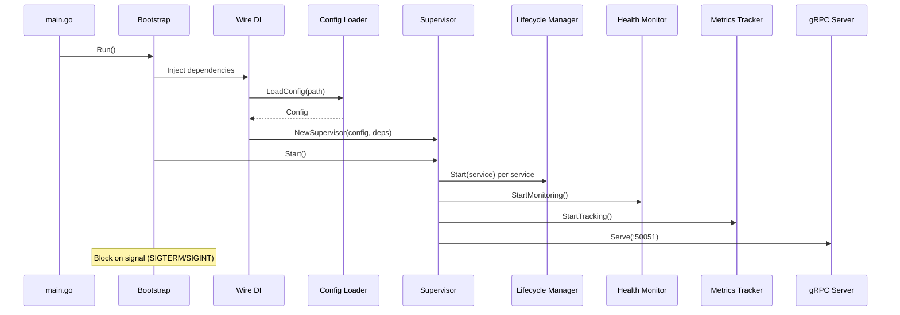
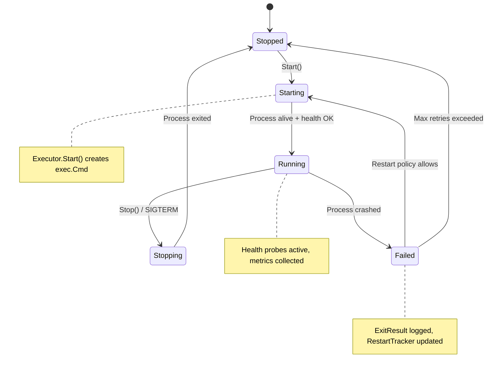
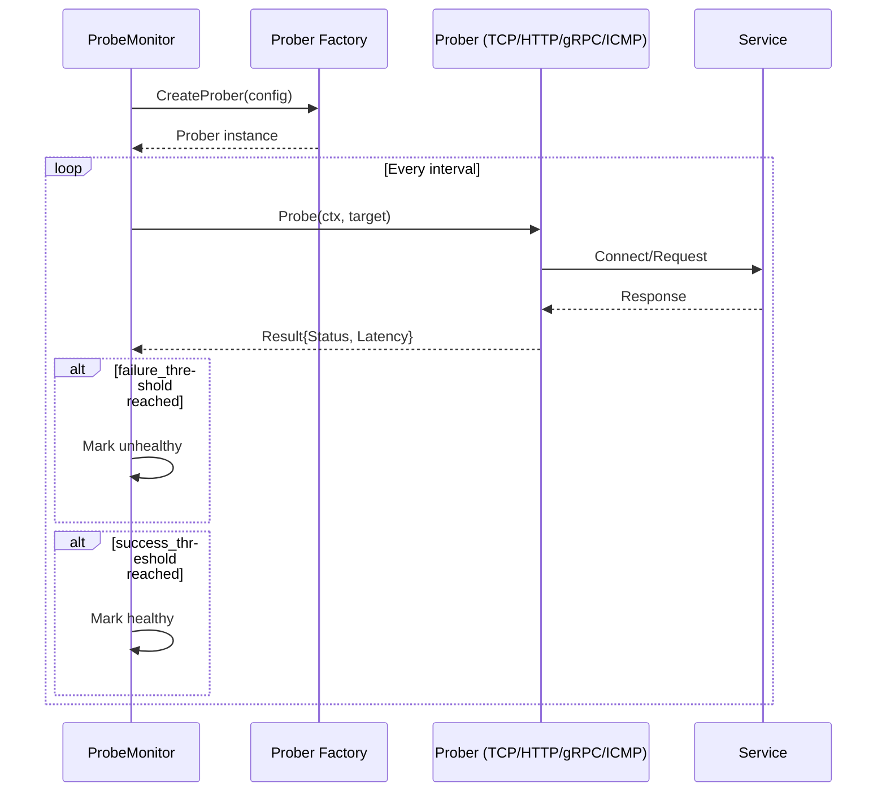
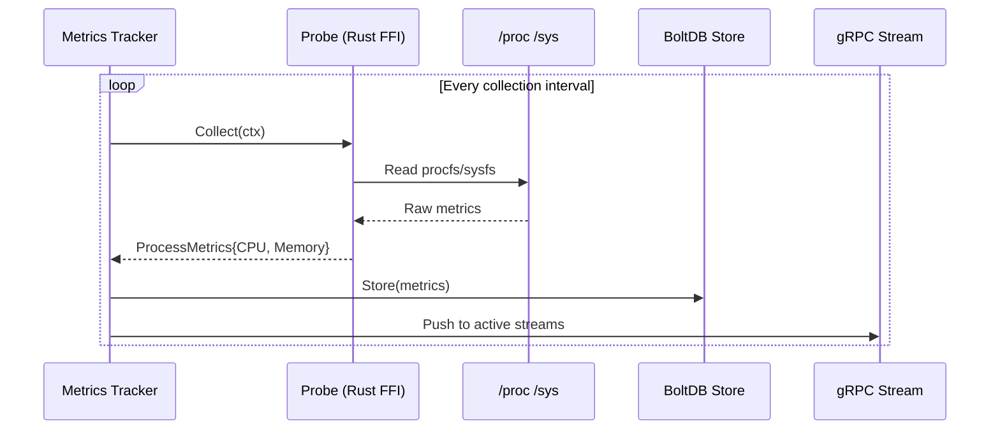
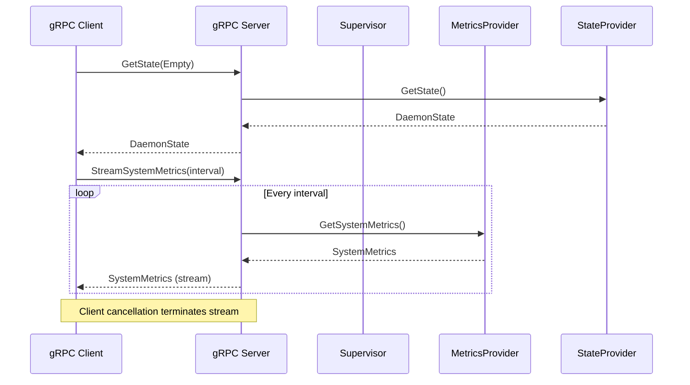
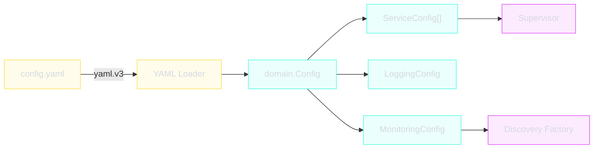

# Data Flow

This page traces the major data flows through the superviz.io daemon, from startup through steady-state operation.

---

## Startup Flow



---

## Process Lifecycle



Each service is managed by a dedicated `lifecycle.Manager` that:

1. Creates the process via the `Executor` port
2. Monitors process exit via waitpid
3. Applies restart policy (always, on-failure, never, unless-stopped)
4. Tracks restart count with backoff delay (configurable `delay` to `delay_max`)

---

## Health Check Flow



Supported probe types:

| Type | Protocol | Check Method |
|------|----------|-------------|
| `tcp` | TCP | Connection establishment |
| `http` | HTTP/HTTPS | Status code + optional path |
| `grpc` | gRPC | `grpc.health.v1.Health/Check` |
| `icmp` | ICMP | Ping (native or fallback mode) |
| `udp` | UDP | Packet send/receive |
| `exec` | Shell | Command exit code |

---

## Metrics Collection Flow



The probe pipeline:

1. **Go** calls `Collector.Collect()` (application port)
2. **CGO/FFI** bridges to `libprobe.a` (Rust static library)
3. **Rust** reads OS-specific APIs (`/proc`, `/sys`, syscalls)
4. **Metrics** flow back through FFI to Go types
5. **BoltDB** persists time-series data
6. **gRPC** streams push to connected clients

---

## gRPC Request Flow



The gRPC server implements two provider interfaces:

```go
type MetricsProvider interface {
    GetProcessMetrics(serviceName string) (metrics.ProcessMetrics, error)
    GetAllProcessMetrics() []metrics.ProcessMetrics
}

type StateProvider interface {
    GetState() state.DaemonState
}
```

---

## Configuration Loading



Configuration flows:

1. **YAML file** parsed by `gopkg.in/yaml.v3`
2. **Domain types** (`ServiceConfig`, `RestartConfig`, `ProbeConfig`) populated
3. **Supervisor** receives service configurations
4. **Discovery factory** receives monitoring/discovery configurations
5. **SIGHUP** triggers config reload via `Reloader` port
