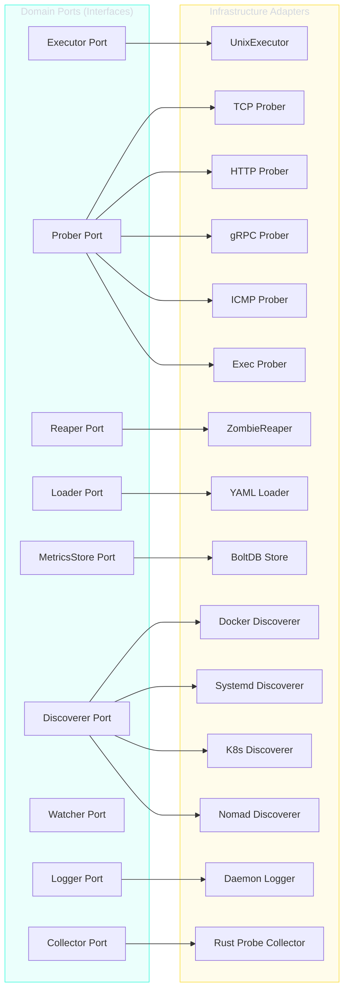

# Hexagonal Architecture

superviz.io strictly follows the hexagonal architecture pattern (also known as ports & adapters), ensuring that business logic remains independent of technical concerns.

---

## Principles

1. **Domain isolation**: The domain layer has zero external dependencies
2. **Port interfaces**: Domain defines interfaces (ports) that infrastructure implements
3. **Dependency inversion**: Infrastructure depends on domain, never the reverse
4. **Compile-time DI**: Google Wire resolves all dependencies at build time

---

## Port & Adapter Map



---

## Wire Dependency Injection

Bootstrap uses Google Wire for compile-time dependency injection. The injector function in `wire.go` declares the dependency graph, and Wire generates `wire_gen.go` with concrete constructor calls.

### Interface Bindings

| Interface | Implementation |
|-----------|----------------|
| `appconfig.Loader` | `*infraconfig.Loader` (YAML) |
| `domain.Executor` | `*infraprocess.UnixExecutor` |
| `domainkernel.ZombieReaper` | `*reaper.UnixZombieReaper` (or nil if not PID1) |

### App Lifecycle

```go
// cmd/daemon/main.go
func main() {
    os.Exit(bootstrap.Run())
}
```

`bootstrap.Run()` performs:

1. Parse CLI flags (config path, TUI mode)
2. Wire-inject all dependencies
3. Load configuration from YAML
4. Create Supervisor with all managers
5. Install signal handlers (SIGTERM, SIGINT, SIGHUP)
6. Start all services
7. Block until shutdown signal
8. Graceful shutdown with cleanup

### Wire Providers

| Provider | Purpose |
|----------|---------|
| `ProvideReaper` | Returns `ZombieReaper` only if running as PID1 |
| `LoadConfig` | Loads configuration via the `Loader` port |
| `NewApp` | Creates the final `App` struct with `Supervisor` and `Cleanup` |

---

## Package Structure

```
src/internal/
├── bootstrap/          # Wire DI, App.Run(), signal handling
├── application/        # Use cases (no infrastructure knowledge)
│   ├── config/         # Loader interface (port)
│   ├── health/         # ProbeMonitor
│   ├── lifecycle/      # Per-service Manager
│   ├── metrics/        # Tracker
│   ├── monitoring/     # ExternalMonitor
│   └── supervisor/     # Main Supervisor
├── domain/             # Pure business logic (no dependencies)
│   ├── config/         # ServiceConfig, RestartConfig, ProbeConfig
│   ├── health/         # Status, Result, Prober port
│   ├── lifecycle/      # Event, DaemonState, Reaper port
│   ├── listener/       # Network listener entities
│   ├── logging/        # LogEvent, LogLevel, Writer/Logger ports
│   ├── metrics/        # SystemCPU, SystemMemory, ProcessMetrics
│   ├── process/        # Spec, State, Executor port, ExitResult
│   ├── shared/         # Duration, Size, Clock value objects
│   ├── storage/        # MetricsStore port
│   └── target/         # ExternalTarget, Discoverer/Watcher ports
└── infrastructure/     # Concrete implementations
    ├── discovery/      # Docker, systemd, K8s, Nomad, etc.
    ├── observability/  # healthcheck, logging, events
    ├── persistence/    # config/yaml, storage/boltdb
    ├── probe/          # Rust FFI system metrics
    ├── process/        # control, credentials, executor, reaper, signals
    └── transport/      # grpc, tui
```

---

## Testing Strategy

| Suffix | Type | Scope |
|--------|------|-------|
| `_external_test.go` | Black-box | Tests public API via `package_test` |
| `_internal_test.go` | White-box | Tests internals within same package |

All tests require race detection: `go test -race ./...`
