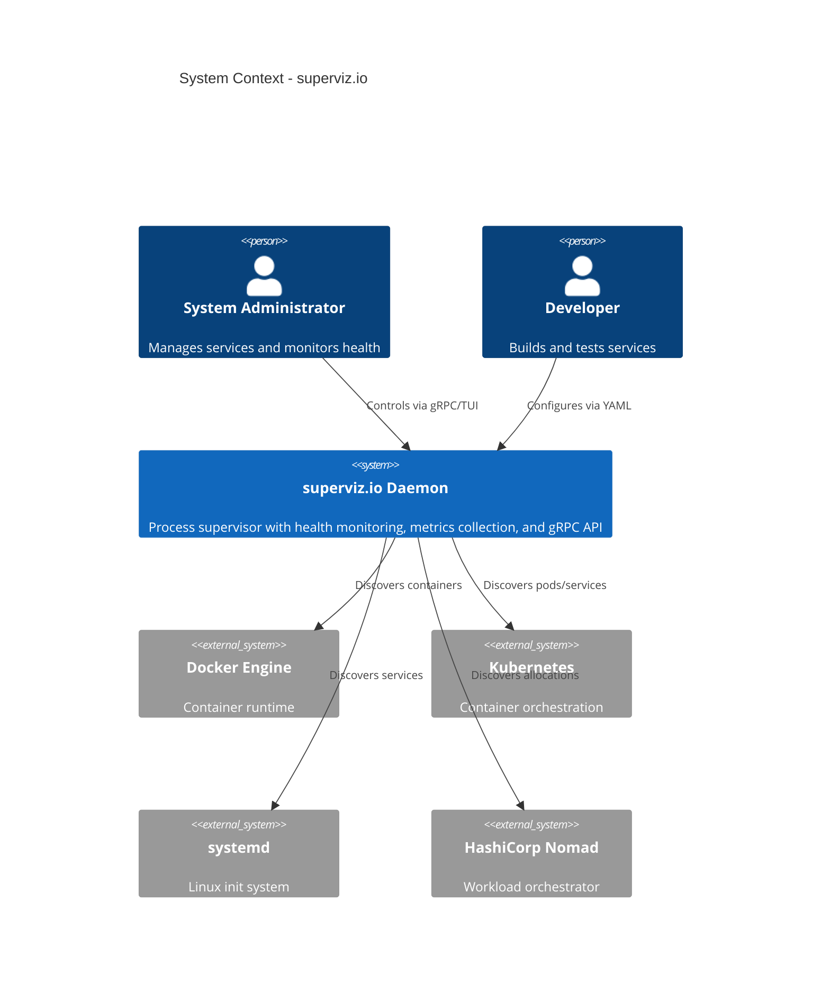
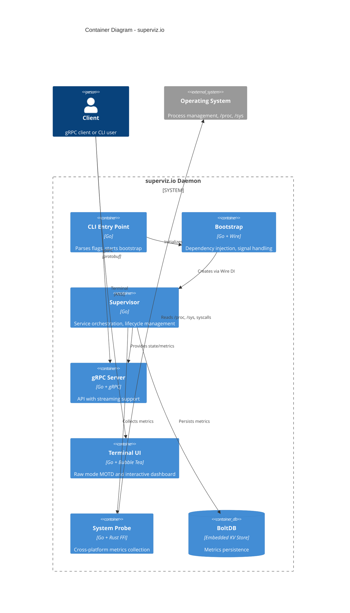
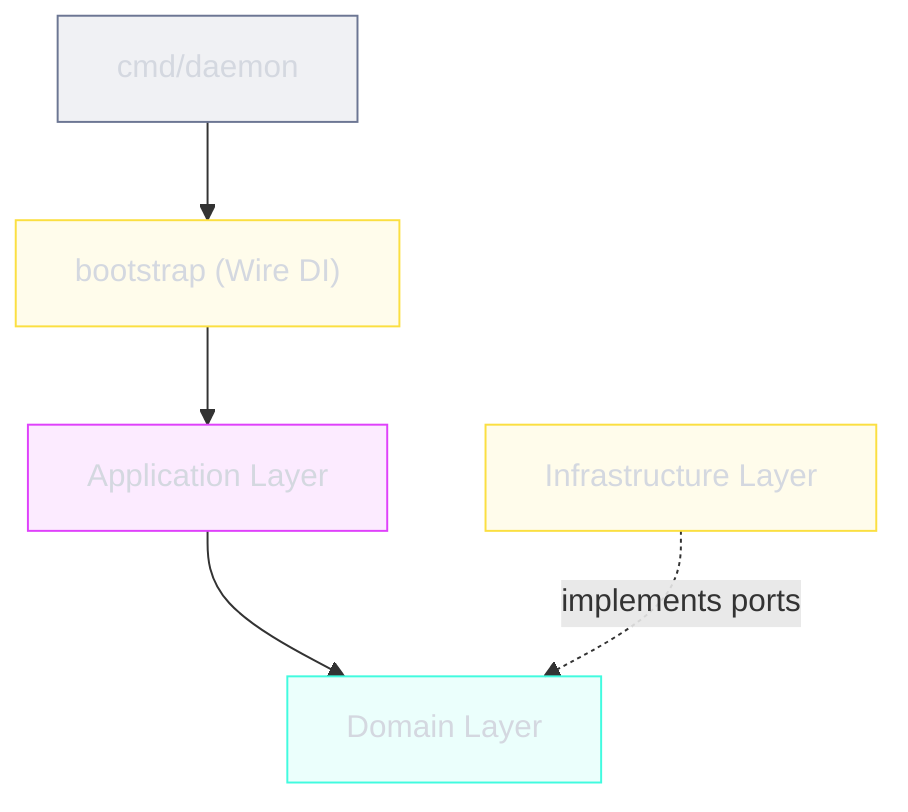

# Architecture

superviz.io implements **hexagonal architecture** (ports & adapters) with domain-driven design principles. The codebase enforces strict dependency rules: the domain layer has zero external dependencies, the application layer depends only on domain, and infrastructure implements domain ports.

---

## C4 Context Diagram

---

## C4 Container Diagram

---

## Layer Overview

### Domain Layer (Pure Business Logic)

Zero external dependencies. Defines entities, value objects, and port interfaces.

| Package | Purpose |
|---------|---------|
| `process` | Process `Spec`, `State`, `Executor` port, `ExitResult` |
| `config` | `ServiceConfig`, `RestartConfig`, `ProbeConfig` value objects |
| `health` | `Status`, `Result`, `Prober` port, `AggregatedHealth` |
| `lifecycle` | `Event` types, `DaemonState`, `Reaper` port |
| `metrics` | `SystemCPU`, `SystemMemory`, `ProcessMetrics` types |
| `logging` | `LogEvent`, `LogLevel`, `Logger`/`Writer` ports |
| `shared` | `Duration`, `Size`, `Clock` value objects |
| `storage` | `MetricsStore` port interface |
| `target` | `ExternalTarget`, `Discoverer`/`Watcher` ports |

### Application Layer (Use Cases)

Orchestrates domain entities through port interfaces.

| Package | Purpose |
|---------|---------|
| `supervisor` | Main service orchestrator, coordinates all managers |
| `lifecycle` | Per-service process lifecycle with restart logic |
| `health` | `ProbeMonitor` coordinates multi-protocol health checks |
| `metrics` | `Tracker` monitors per-process CPU/memory |
| `monitoring` | `ExternalMonitor` for unmanaged targets |
| `config` | `Loader`/`Reloader` port interfaces |

### Infrastructure Layer (Adapters)

Implements domain ports with concrete technologies.

| Package | Implements | Technology |
|---------|-----------|------------|
| `process/executor` | `domain.Executor` | `exec.Cmd`, signals |
| `process/reaper` | `domain.Reaper` | `waitpid` (PID1 mode) |
| `persistence/config/yaml` | `app.Loader` | `gopkg.in/yaml.v3` |
| `persistence/storage/boltdb` | `domain.MetricsStore` | `go.etcd.io/bbolt` |
| `observability/healthcheck` | `domain.Prober` | TCP, HTTP, gRPC, ICMP, exec |
| `probe` | `app.Collector` | Rust FFI via CGO |
| `discovery` | `domain.Discoverer` | Docker, systemd, K8s APIs |
| `transport/grpc` | gRPC server | `google.golang.org/grpc` |
| `transport/tui` | Terminal UI | `charmbracelet/bubbletea` |

---

## Dependency Rules

- Application depends on Domain (never reverse)
- Infrastructure implements Domain ports (dependency inversion)
- No circular dependencies between packages
- Bootstrap wires everything together via Google Wire
