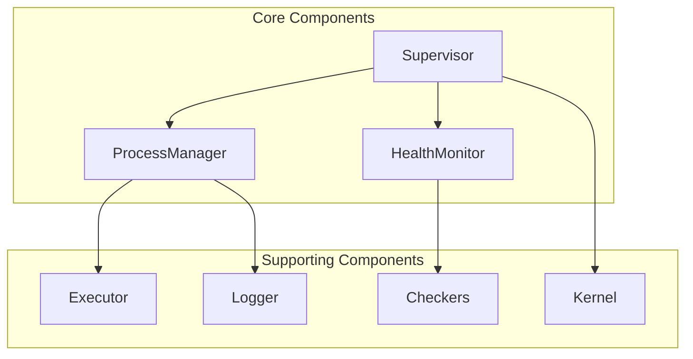
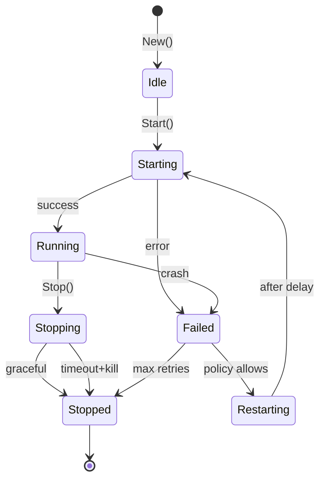
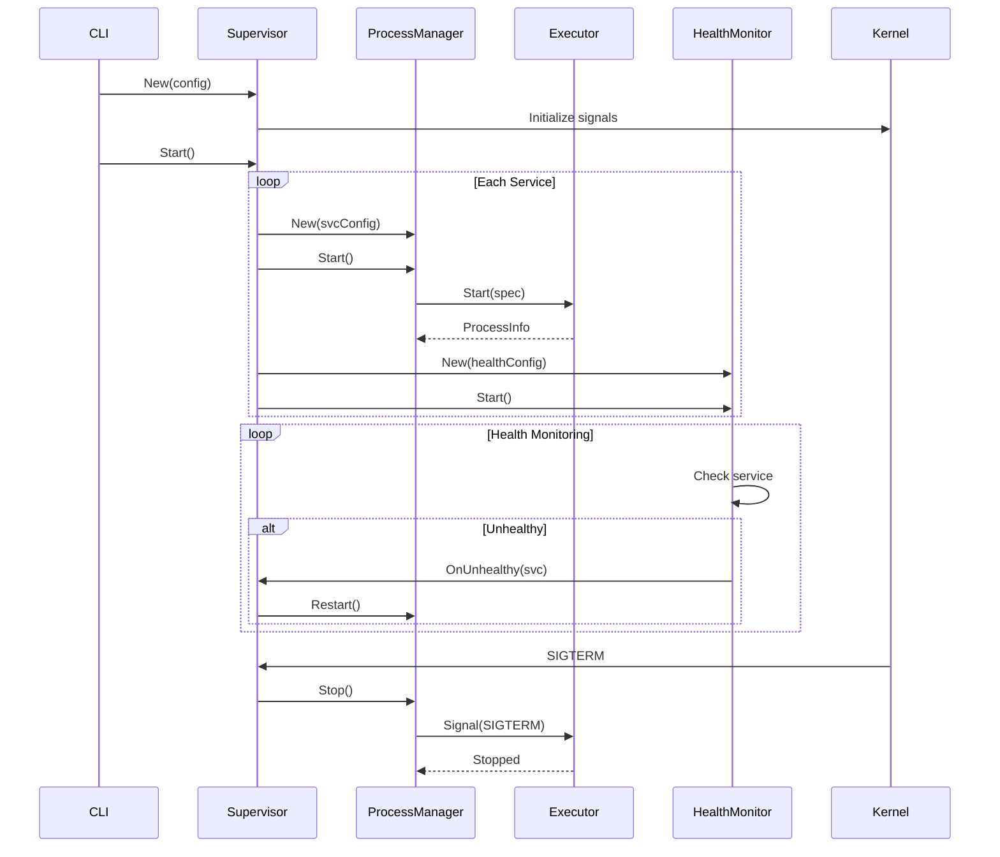

# Components

Detailed documentation of superviz.io's core components.

## Overview



---

## Supervisor

The central orchestrator managing all services.

### Responsibilities

```
┌────────────────────────────────────────────────────────────────────┐
│                         SUPERVISOR                                  │
├────────────────────────────────────────────────────────────────────┤
│                                                                     │
│  • Load and validate configuration                                 │
│  • Create ProcessManager per service                               │
│  • Create HealthMonitor per service                                │
│  • Handle OS signals (SIGTERM, SIGHUP, SIGCHLD)                   │
│  • Coordinate graceful shutdown                                    │
│  • Track service statistics                                        │
│  • Manage service dependencies                                     │
│                                                                     │
└────────────────────────────────────────────────────────────────────┘
```

### API

```go
// Create new supervisor
sup := supervisor.New(config, kernelInstance)

// Start all services
err := sup.Start()

// Stop all services gracefully
err := sup.Stop()

// Reload configuration
err := sup.Reload()

// Get service info
info := sup.ServiceInfo("webapp")

// Get statistics
stats := sup.Stats("webapp")
allStats := sup.AllStats()

// Set event handler
sup.SetEventHandler(func(name string, event *Event) {
    log.Printf("Service %s: %v", name, event)
})
```

### Event Types

| Event | Description |
|-------|-------------|
| `EventStarted` | Service process started |
| `EventStopped` | Service stopped normally |
| `EventFailed` | Service crashed |
| `EventRestarting` | Service is restarting |
| `EventHealthy` | Health check passed |
| `EventUnhealthy` | Health check failed |

---

## ProcessManager

Manages the lifecycle of a single service process.

### State Machine



### API

```go
// Create manager for a service
pm := process.NewManager(serviceConfig, executor, logger)

// Start the process
info, err := pm.Start()

// Stop gracefully with timeout
err := pm.Stop(30 * time.Second)

// Get current state
state := pm.State()

// Get process info
info := pm.Info()

// Check if running
running := pm.IsRunning()
```

### Restart Policies

```
┌──────────────────┬────────────────────────────────────────────────┐
│ Policy           │ Behavior                                        │
├──────────────────┼────────────────────────────────────────────────┤
│ always           │ Always restart, regardless of exit code        │
│ on-failure       │ Restart only if exit code != 0                 │
│ never            │ Never restart                                   │
│ unless-stopped   │ Restart unless manually stopped                │
└──────────────────┴────────────────────────────────────────────────┘
```

### Backoff Configuration

```yaml
restart:
  policy: always
  max_retries: 5      # 0 = unlimited
  delay: 5s           # Initial delay
  delay_max: 5m       # Maximum delay (cap)
  multiplier: 2       # Exponential multiplier
```

---

## HealthMonitor

Monitors service health via periodic checks.

### Architecture

```
┌────────────────────────────────────────────────────────────────────┐
│                       HEALTH MONITOR                                │
├────────────────────────────────────────────────────────────────────┤
│                                                                     │
│   ┌─────────┐     ┌─────────────┐     ┌──────────────────┐        │
│   │ Ticker  │────▶│   Check     │────▶│  Update Status   │        │
│   │(interval)│    │  Executor   │     │                  │        │
│   └─────────┘     └─────────────┘     └────────┬─────────┘        │
│                                                 │                   │
│                                    ┌────────────┴────────────┐     │
│                                    │                         │     │
│                                    ▼                         ▼     │
│                           ┌──────────────┐          ┌────────────┐ │
│                           │   Healthy    │          │  Unhealthy │ │
│                           │ (reset count)│          │(incr count)│ │
│                           └──────────────┘          └─────┬──────┘ │
│                                                           │        │
│                                              count >= retries?     │
│                                                           │        │
│                                                           ▼        │
│                                                   ┌──────────────┐ │
│                                                   │   Callback   │ │
│                                                   │ (on failure) │ │
│                                                   └──────────────┘ │
│                                                                     │
└────────────────────────────────────────────────────────────────────┘
```

### Check Types

#### HTTP Check

```yaml
health_checks:
  - type: http
    endpoint: http://localhost:8080/health
    method: GET                    # GET, POST, HEAD
    headers:
      Authorization: Bearer token
    expected_status: 200           # Expected HTTP status
    expected_body: "ok"            # Optional body match
    interval: 30s
    timeout: 5s
    retries: 3
```

```
Request:
  GET /health HTTP/1.1
  Host: localhost:8080
  Authorization: Bearer token

Response (healthy):
  HTTP/1.1 200 OK
  Content-Type: application/json
  {"status": "ok"}

Response (unhealthy):
  HTTP/1.1 503 Service Unavailable
  {"status": "error", "message": "database down"}
```

#### TCP Check

```yaml
health_checks:
  - type: tcp
    host: localhost
    port: 5432
    interval: 30s
    timeout: 5s
    retries: 3
```

```
Check Process:
  1. Open TCP connection to host:port
  2. If connection succeeds within timeout → Healthy
  3. If connection fails or times out → Unhealthy
```

#### Command Check

```yaml
health_checks:
  - type: command
    command: /usr/bin/pg_isready
    args:
      - -h
      - localhost
    interval: 30s
    timeout: 10s
    retries: 3
```

```
Check Process:
  1. Execute command with args
  2. If exit code == 0 → Healthy
  3. If exit code != 0 → Unhealthy
  4. If timeout exceeded → Unhealthy
```

---

## Executor

Infrastructure adapter for process execution.

### Interface (Port)

```go
// domain/process/port.go
type Executor interface {
    // Start spawns a new process
    Start(spec Spec) (ProcessInfo, error)

    // Stop terminates a process gracefully
    Stop(pid int, timeout time.Duration) error

    // Signal sends a signal to a process
    Signal(pid int, sig os.Signal) error

    // Wait waits for process completion
    Wait(pid int) (ExitResult, error)
}
```

### Unix Implementation

```go
// infrastructure/process/executor.go
type UnixExecutor struct {
    credentials CredentialResolver
    logger      LogCapture
}

func (e *UnixExecutor) Start(spec Spec) (ProcessInfo, error) {
    cmd := exec.Command(spec.Command, spec.Args...)

    // Set working directory
    cmd.Dir = spec.WorkingDir

    // Set environment
    cmd.Env = spec.Environment

    // Set user/group if specified
    if spec.User != "" {
        cred, _ := e.credentials.Resolve(spec.User, spec.Group)
        cmd.SysProcAttr = &syscall.SysProcAttr{
            Credential: cred,
        }
    }

    // Capture output
    cmd.Stdout = e.logger.Stdout(spec.Name)
    cmd.Stderr = e.logger.Stderr(spec.Name)

    // Start process
    err := cmd.Start()
    return ProcessInfo{PID: cmd.Process.Pid}, err
}
```

---

## Kernel Components

OS-level abstractions for portability.

### Signal Manager

```go
// infrastructure/kernel/ports/signals.go
type SignalManager interface {
    // Forward forwards a signal to a process
    Forward(pid int, sig os.Signal) error

    // RegisterHandler registers a signal handler
    RegisterHandler(sig os.Signal, handler func())

    // DefaultSignals returns signals to handle
    DefaultSignals() []os.Signal
}
```

### Reaper (PID 1 mode)

```go
// infrastructure/kernel/ports/reaper.go
type Reaper interface {
    // Start starts the reaper goroutine
    Start(ctx context.Context) error

    // Reap reaps a specific PID
    Reap(pid int) (int, error)

    // SetCallback sets the callback for reaped processes
    SetCallback(func(pid int, status int))
}
```

```
┌────────────────────────────────────────────────────────────────────┐
│                   ZOMBIE REAPING (PID 1)                           │
├────────────────────────────────────────────────────────────────────┤
│                                                                     │
│  When running as PID 1:                                            │
│                                                                     │
│  1. SIGCHLD received                                               │
│  2. Reaper calls waitpid(-1, &status, WNOHANG)                    │
│  3. Loop until no more zombies:                                    │
│     • Get zombie PID and exit status                              │
│     • If managed process → notify ProcessManager                   │
│     • If orphaned process → just reap and discard                 │
│                                                                     │
│  ┌─────────┐   SIGCHLD   ┌─────────┐   waitpid   ┌─────────┐     │
│  │ Zombie  │────────────▶│ Reaper  │────────────▶│ Cleanup │     │
│  │ Process │             │         │             │         │     │
│  └─────────┘             └─────────┘             └─────────┘     │
│                                                                     │
└────────────────────────────────────────────────────────────────────┘
```

### Credentials Resolver

```go
// infrastructure/kernel/ports/credentials.go
type CredentialResolver interface {
    // LookupUser looks up a user by name or UID
    LookupUser(name string) (*User, error)

    // LookupGroup looks up a group by name or GID
    LookupGroup(name string) (*Group, error)

    // Resolve returns syscall credentials
    Resolve(user, group string) (*syscall.Credential, error)
}
```

---

## Logging Components

Log capture and rotation system.

### Architecture

```
┌────────────────────────────────────────────────────────────────────┐
│                      LOGGING PIPELINE                               │
├────────────────────────────────────────────────────────────────────┤
│                                                                     │
│  Process                                                           │
│  ┌─────────────────┐                                               │
│  │ stdout ─────────┼──┐                                            │
│  │ stderr ─────────┼──┼──▶ LineWriter                              │
│  └─────────────────┘  │        │                                   │
│                       │        ▼                                   │
│                       │   TimestampWriter                          │
│                       │        │                                   │
│                       │        ▼                                   │
│                       │   MultiWriter                              │
│                       │        │                                   │
│                       │   ┌────┴────┐                              │
│                       │   │         │                              │
│                       │   ▼         ▼                              │
│                       │ FileWriter Passthrough                     │
│                       │   │         │                              │
│                       │   ▼         ▼                              │
│                       │ Rotation   Console                         │
│                       │                                            │
└───────────────────────┴────────────────────────────────────────────┘
```

### Components

#### Writer

```go
// Base file writer with rotation support
type Writer struct {
    path     string
    file     *os.File
    size     int64
    maxSize  int64
    maxFiles int
}

func (w *Writer) Write(p []byte) (int, error) {
    if w.size + int64(len(p)) > w.maxSize {
        w.rotate()
    }
    n, err := w.file.Write(p)
    w.size += int64(n)
    return n, err
}
```

#### LineWriter

```go
// Buffers partial lines until newline
type LineWriter struct {
    writer io.Writer
    prefix string
    buffer []byte
}

func (lw *LineWriter) Write(p []byte) (int, error) {
    // Buffer data until newline
    // Write complete lines with prefix
}

func (lw *LineWriter) Flush() error {
    // Flush remaining buffered data
}
```

#### Capture

```go
// Coordinates stdout/stderr capture for a service
type Capture struct {
    stdout io.WriteCloser
    stderr io.WriteCloser
}

func NewCapture(cfg ServiceConfig) (*Capture, error) {
    // Create writers based on config
    // Setup rotation if configured
    // Return capture instance
}
```

### Rotation Configuration

```yaml
logging:
  defaults:
    rotation:
      max_size: 100MB     # Rotate when file exceeds size
      max_age: 7d         # Delete files older than this
      max_files: 10       # Keep at most N files
      compress: true      # Gzip old files
```

---

## Component Interactions


