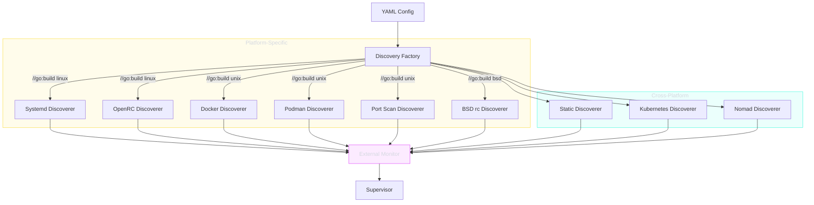

# Service Discovery

The discovery subsystem automatically finds external services to monitor through platform-specific backends. Each discoverer implements the `domain/target.Discoverer` port interface.

**Package**: `internal/infrastructure/discovery`

---

## Discovery Architecture



---

## Discoverers

### Docker

Discovers containers via the Docker Engine API.

- Connects to Docker socket (`/var/run/docker.sock`)
- Filters by container labels (`supervizio.monitor: "true"`)
- Extracts port mappings automatically
- Supports health status from Docker health checks

### Podman

API-compatible with Docker, using the Podman socket.

- Socket: `/run/podman/podman.sock`
- Same label filtering mechanism
- Same port mapping extraction

### systemd (Linux)

Discovers systemd services by glob pattern.

- Uses `systemctl` for service enumeration
- Supports glob patterns (`"postgresql*.service"`)
- Reads service status (active/inactive/failed)

### OpenRC (Alpine/Gentoo)

Discovers OpenRC-managed services.

- Parses OpenRC service status
- Pattern-based filtering

### BSD rc (FreeBSD/OpenBSD/NetBSD)

Discovers BSD rc.d services.

- Reads `/etc/rc.d/` and `/usr/local/etc/rc.d/`
- Pattern-based filtering

### Kubernetes

Discovers pods and services via the Kubernetes API.

- Supports kubeconfig and in-cluster authentication
- Namespace filtering
- Label selector filtering
- Reads pod status and container ports

### Nomad

Discovers HashiCorp Nomad allocations via HTTP API.

- Connects to Nomad API endpoint
- Namespace and job name filtering
- Reads allocation status

### Port Scan

Discovers services by scanning listening ports.

- Scans specified network interfaces
- Excludes configurable port list
- Platform: Unix only

### Static

Explicitly configured targets from YAML.

- Always available on all platforms
- Defined in `monitoring.targets` section

---

## Platform Build Tags

| Build Tag | Discoverers Available |
|-----------|----------------------|
| `//go:build linux` | systemd, OpenRC, Docker, Podman, Port Scan, Static, K8s, Nomad |
| `//go:build darwin` | Docker, Podman, Port Scan, Static, K8s, Nomad |
| `//go:build bsd` | BSD rc, Docker, Podman, Port Scan, Static, K8s, Nomad |
| `//go:build !unix` | Static, K8s, Nomad |

---

## Domain Port

```go
// target.Discoverer discovers external monitoring targets.
type Discoverer interface {
    Discover(ctx context.Context) ([]ExternalTarget, error)
}

// target.Watcher watches for target changes in real-time.
type Watcher interface {
    Watch(ctx context.Context) (<-chan []ExternalTarget, error)
}
```
