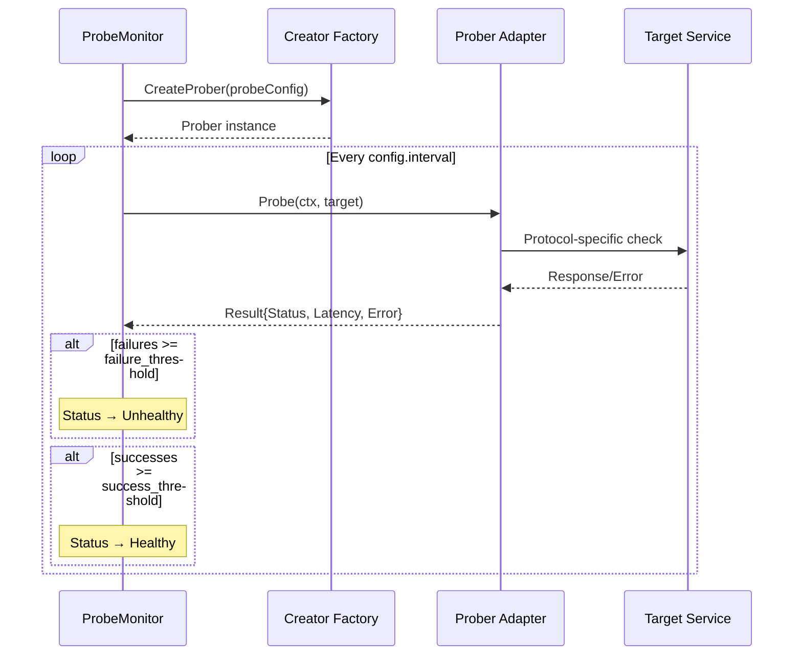
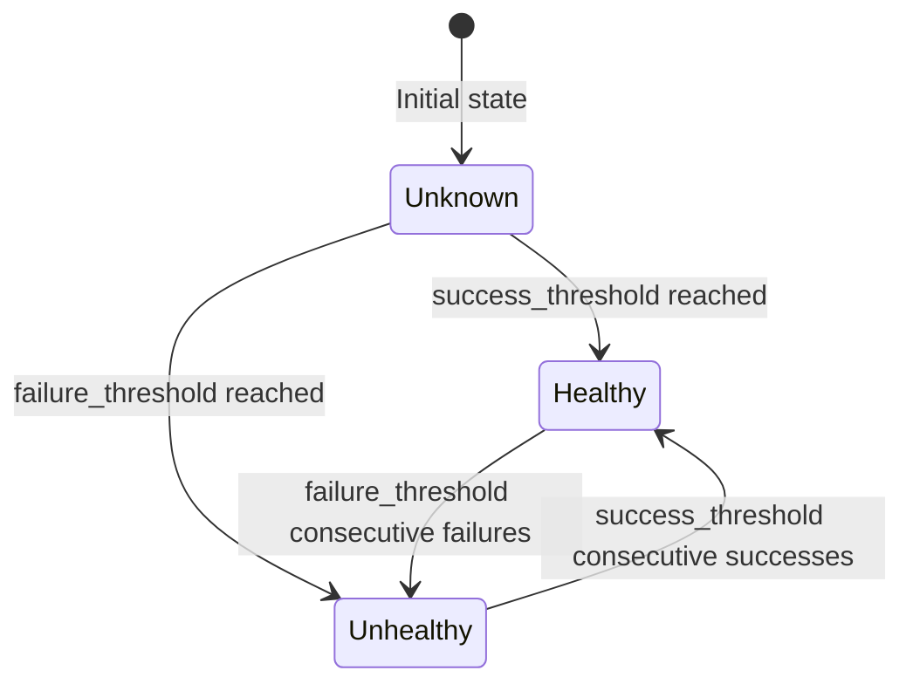

# Health Monitoring

The `ProbeMonitor` coordinates multi-protocol health checking for supervised services. It uses the `Prober` domain port with multiple infrastructure adapters for different protocols.

**Package**: `internal/application/health`

---

## Probe Types

| Type | Protocol | Check Method | Adapter Package |
|------|----------|-------------|-----------------|
| `tcp` | TCP | Connection establishment | `observability/healthcheck` |
| `http` | HTTP/HTTPS | Status code + path | `observability/healthcheck` |
| `grpc` | gRPC | `grpc.health.v1.Health/Check` | `observability/healthcheck` |
| `icmp` | ICMP | Ping (native/fallback) | `observability/healthcheck` |
| `udp` | UDP | Packet send/receive | `observability/healthcheck` |
| `exec` | Shell | Command exit code | `observability/healthcheck` |

---

## Health Flow

---

## Health Status

---

## Domain Types

### Health Status

| Value | Description |
|-------|-------------|
| `Unknown` | No checks performed yet |
| `Healthy` | Service is reachable and responding correctly |
| `Unhealthy` | Service failed consecutive health checks |

### Health Result

Each probe execution produces a `Result`:

| Field | Description |
|-------|-------------|
| `Status` | Healthy or Unhealthy |
| `Latency` | Response time |
| `Error` | Error details (if failed) |
| `Timestamp` | Check time |

### AggregatedHealth

Combines health results from all probes for a service:

| Field | Description |
|-------|-------------|
| `Overall` | Combined health status |
| `Results` | Per-probe results |
| `HealthyCount` | Number of healthy probes |
| `UnhealthyCount` | Number of unhealthy probes |

---

## ICMP Modes

The ICMP prober supports three modes:

| Mode | Description |
|------|-------------|
| `native` | Uses raw ICMP sockets (requires `CAP_NET_RAW` or root) |
| `fallback` | Uses `/bin/ping` command (works in containers) |
| `auto` | Tries native first, falls back to command |
