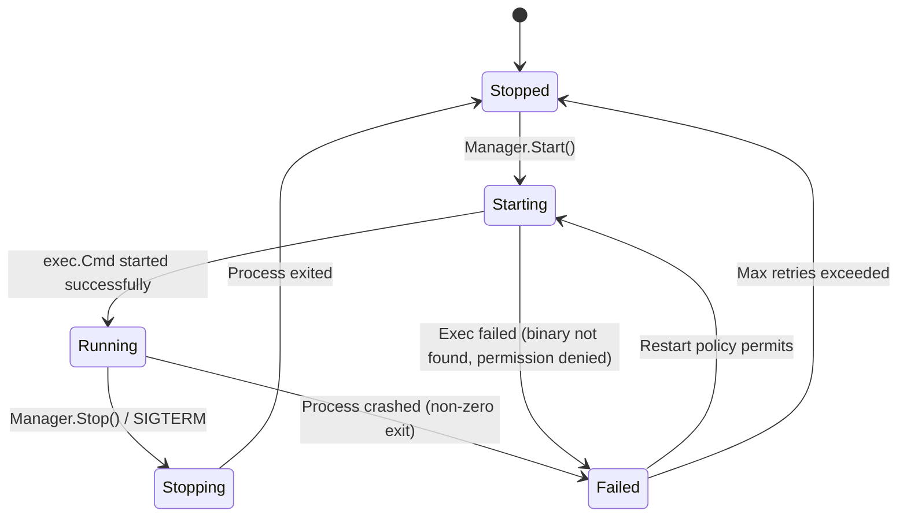

# Process Lifecycle

The `Manager` handles per-service process lifecycle management including starting, stopping, restarting, and crash recovery with configurable restart policies.

**Package**: `internal/application/lifecycle`

---

## State Machine



---

## Restart Policies

| Policy | Behavior |
|--------|----------|
| `always` | Restart on any exit, including exit code 0 |
| `on-failure` | Restart only on non-zero exit code |
| `never` | Never restart after exit |
| `unless-stopped` | Restart unless explicitly stopped via API |

---

## Backoff Strategy

The restart delay uses exponential backoff:

| Restart # | Delay (with delay=5s, delay_max=60s) |
|-----------|--------------------------------------|
| 1 | 5s |
| 2 | 10s |
| 3 | 20s |
| 4 | 40s |
| 5+ | 60s (capped at delay_max) |

A successful health check resets the restart counter and delay.

---

## Domain Types

### Process Spec

Immutable specification for a process, derived from service configuration:

- Command and arguments
- Working directory
- User/group credentials
- Environment variables

### Process State

Runtime state of a managed process:

- PID (0 if not running)
- Current lifecycle state (enum)
- Start time and uptime
- Restart count
- Last error message

### ExitResult

Captured when a process exits:

- Exit code
- Signal (if killed)
- Runtime duration
- Error details

### RestartTracker

Tracks restart history for backoff calculation:

- Consecutive failure count
- Last restart time
- Current delay value

---

## Executor Port

The `Executor` interface (domain port) abstracts OS process management:

```go
type Executor interface {
    Start(ctx context.Context, spec Spec) (State, error)
    Stop(ctx context.Context, pid int, timeout time.Duration) error
    Signal(pid int, sig os.Signal) error
    Wait(pid int) (ExitResult, error)
}
```

Implemented by `infrastructure/process/executor.UnixExecutor` which uses `exec.Cmd`.
