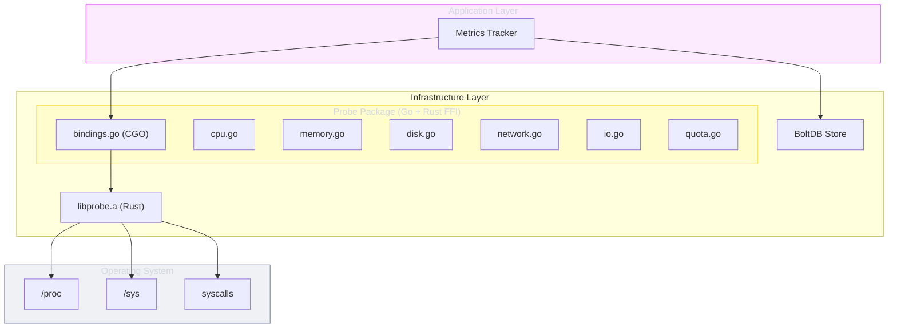

# Metrics & Probe

The metrics system collects system-wide and per-process resource usage via a Rust FFI probe library, persists data in BoltDB, and streams metrics over gRPC.

---

## Architecture



---

## Rust FFI Probe

The probe library is a Rust static library (`libprobe.a`) compiled as a C-compatible shared object, accessed from Go via CGO/FFI.

**Architecture**: Go → CGO/FFI → libprobe.a (Rust) → OS APIs

### Initialization

```go
probe.Init()                    // Initialize once at startup
defer probe.Shutdown()
c := probe.NewCollector()       // Create collector
```

### Collectors

| Collector | Metrics | Source |
|-----------|---------|--------|
| `Cpu()` | User/system/idle time, usage % | `/proc/stat`, `sysctl` |
| `Memory()` | Total/available/used/free/swap | `/proc/meminfo`, `sysctl` |
| `Disk()` | Partitions, usage, I/O stats | `/proc/diskstats`, `statvfs` |
| `Network()` | Interfaces, TX/RX bytes/packets | `/proc/net/dev`, `getifaddrs` |
| `Io()` | I/O stats, pressure | `/proc/pressure/io` |
| `Quota()` | Resource limits | cgroups, `getrlimit`, `rctl` |

---

## Platform Support

| Platform | CPU | Memory | Disk | Network | I/O | Quotas |
|----------|-----|--------|------|---------|-----|--------|
| Linux amd64/arm64 | Full | Full | Full | Full | Full | cgroups v1/v2 |
| macOS amd64/arm64 | Partial | Partial | Partial | Partial | - | getrlimit |
| FreeBSD amd64 | Partial | Partial | Partial | Partial | - | rctl |
| OpenBSD amd64 | Partial | Partial | Partial | Partial | - | getrlimit |
| NetBSD amd64 | Partial | Partial | Partial | Partial | - | getrlimit |

---

## Process Metrics

Per-process metrics collected by the Tracker:

### CPU Metrics

| Field | Type | Description |
|-------|------|-------------|
| `user_time_ns` | `uint64` | User mode CPU time (nanoseconds) |
| `system_time_ns` | `uint64` | System mode CPU time (nanoseconds) |
| `total_time_ns` | `uint64` | Total CPU time (nanoseconds) |
| `usage_percent` | `float64` | CPU usage (0-100 per core) |

### Memory Metrics

| Field | Type | Description |
|-------|------|-------------|
| `rss_bytes` | `uint64` | Resident set size |
| `vms_bytes` | `uint64` | Virtual memory size |
| `swap_bytes` | `uint64` | Swap usage |
| `shared_bytes` | `uint64` | Shared memory |
| `data_bytes` | `uint64` | Data segment size |
| `stack_bytes` | `uint64` | Stack size |

---

## System Metrics

System-wide metrics collected at configurable intervals:

### CPU

Full breakdown: user, nice, system, idle, iowait, irq, softirq, steal, and overall usage percentage.

### Memory

Total, available, used, free, buffers, cached, shared, and swap (total/used/free) with usage percentage.

### Load Average

1-minute, 5-minute, and 15-minute load averages.

---

## Persistence

Metrics are persisted in BoltDB (embedded key-value store) via the `MetricsStore` domain port:

- **Storage**: `go.etcd.io/bbolt`
- **Format**: Binary-encoded metric snapshots
- **Purpose**: Historical data for API queries and TUI display

---

## Build Requirements

```bash
# Build Rust probe library first
make build-probe

# Build Go daemon with probe linked
make build-daemon

# Build both in sequence
make build-hybrid
```

Requires CGO enabled: `CGO_ENABLED=1`
