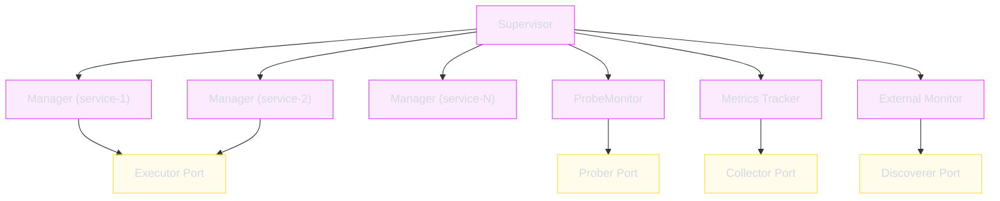

# Supervisor

The `Supervisor` is the top-level orchestrator in the application layer. It coordinates all service lifecycle managers, health monitors, metrics trackers, and external monitors.

**Package**: `internal/application/supervisor`

---

## Responsibilities

- Start and stop all configured services
- Coordinate lifecycle managers (one per service)
- Manage health monitoring across all services
- Track metrics for all processes
- Handle graceful shutdown with ordered cleanup

---

## Data Flow



---

## Lifecycle

1. **Construction**: Wire DI creates Supervisor with all dependencies injected
2. **Start**: Iterates service configs, creates a `lifecycle.Manager` per service
3. **Running**: All managers run concurrently; health/metrics/monitoring loops active
4. **Shutdown**: Receives signal → stops all managers in reverse order → cleanup

---

## Key Interfaces

The Supervisor implements provider interfaces consumed by the gRPC server:

```go
type MetricsProvider interface {
    GetProcessMetrics(serviceName string) (metrics.ProcessMetrics, error)
    GetAllProcessMetrics() []metrics.ProcessMetrics
}

type StateProvider interface {
    GetState() state.DaemonState
}
```
