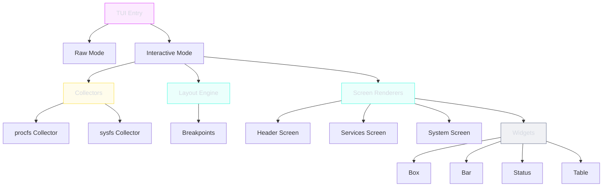

# Terminal UI

The TUI provides both a static startup banner (raw mode) and an interactive real-time dashboard (interactive mode) using the Bubble Tea framework.

**Package**: `internal/infrastructure/transport/tui`

---

## Modes

| Mode | Flag | Description |
|------|------|-------------|
| Raw | Default (no flag) | Static MOTD snapshot at startup + log stream |
| Interactive | `--tui` | Real-time dashboard with 1Hz refresh |

---

## Raw Mode

Displays static startup information only --- no dynamic data that would become stale:

- Version, hostname, OS/arch, runtime mode, config path
- System metrics "at start" (CPU/RAM/Swap/Disk)
- Cgroup limits, detected sandboxes
- Service names with ports (plain text, no colors)

**Not shown** (would become stale): Uptime, service states/PIDs, network rates.

---

## Interactive Mode

Real-time TUI dashboard refreshing at 1Hz:

```
┌─ Header ──────────────────────────────────────────────────┐
│  superviz.io v1.0.0  │  host: server01  │  up: 2d 4h 12m │
├─ Services ────────────────────────────────────────────────┤
│  web-server    RUNNING  PID:1234  CPU:2.3%  MEM:128MB    │
│  worker        RUNNING  PID:5678  CPU:0.8%  MEM:64MB     │
│  scheduler     FAILED   PID:0     Restarts:3             │
├─ System ──────────────────────────────────────────────────┤
│  CPU [████████░░░░░░] 56%    MEM [██████░░░░░░] 42%      │
│  Load: 1.23 / 0.98 / 0.75    Swap: 0MB / 2048MB         │
└───────────────────────────────────────────────────────────┘
```

---

## Component Architecture



---

## Layout Breakpoints

| Width | Raw Mode | Interactive |
|-------|----------|-------------|
| < 80 | Compact (header + services) | 1 column |
| 80-159 | Normal (stacked sections) | 1-2 columns |
| >= 160 | Wide (side-by-side) | 2-3 columns |

---

## Data Flow

```
TUI.Run() → Collectors.CollectAll() → ServiceProvider.Services() → Renderer.Render()
```

---

## Constraints

| Constraint | Rationale |
|-----------|-----------|
| No `exec.Command` | All data from procfs/sysfs/syscalls |
| Pure Go | No CGO dependencies (unlike probe package) |
| Cross-platform | Linux priority, BSD/macOS best effort |
| Graceful degradation | Missing data shows "-" or "unknown" |

---

## Key Types

| Type | Package | Description |
|------|---------|-------------|
| `TUI` | `tui` | Main TUI struct, mode selection |
| `Snapshot` | `model` | Complete state for display |
| `ServiceSnapshot` | `model` | Per-service state |
| `Collector` | `collector` | Data collection interface |
| `Layout` | `layout` | Responsive layout manager |
| `Theme` | `ansi` | ANSI color themes |
