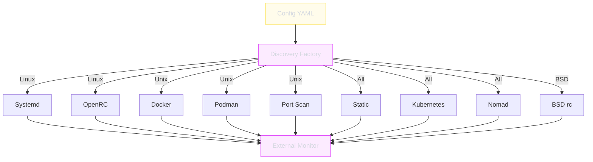

# Monitoring Configuration

The monitoring section configures external target monitoring through service discovery and static target definitions. This is separate from service health probes --- monitoring tracks targets that superviz.io does not manage.

---

## Full Example

```yaml
monitoring:
  defaults:
    interval: 30s
    timeout: 5s
    success_threshold: 1
    failure_threshold: 3

  discovery:
    systemd:
      enabled: true
      patterns:
        - "nginx.service"
        - "postgresql*.service"
    docker:
      enabled: true
      socket_path: "/var/run/docker.sock"
      labels:
        supervizio.monitor: "true"
    kubernetes:
      enabled: false
      namespaces: [default, production]
      label_selector: "app=myapp"
    nomad:
      enabled: false
      address: "http://localhost:4646"

  port_scan:
    enabled: true
    interfaces: [eth0, lo]
    exclude_ports: [22, 3306]

  targets:
    - name: "database"
      address: "localhost:5432"
      probe:
        type: tcp
        interval: 10s
```

---

## Defaults

Global probe defaults applied to all monitoring targets unless overridden.

| Field | Type | Default | Description |
|-------|------|---------|-------------|
| `interval` | `duration` | `30s` | Default check interval |
| `timeout` | `duration` | `5s` | Default check timeout |
| `success_threshold` | `int` | `1` | Default successes before healthy |
| `failure_threshold` | `int` | `3` | Default failures before unhealthy |

---

## Service Discovery

### systemd (Linux only)

Discovers systemd services by glob pattern.

```yaml
discovery:
  systemd:
    enabled: true
    patterns:
      - "nginx.service"
      - "postgresql*.service"
      - "redis*.service"
```

| Field | Type | Description |
|-------|------|-------------|
| `enabled` | `bool` | Enable systemd discovery |
| `patterns` | `list[string]` | Glob patterns for service names |

### OpenRC (Alpine/Gentoo)

```yaml
discovery:
  openrc:
    enabled: true
    patterns:
      - "nginx"
      - "postgresql"
```

### BSD rc (FreeBSD/OpenBSD/NetBSD)

```yaml
discovery:
  bsdrc:
    enabled: true
    patterns:
      - "nginx"
      - "postgresql"
```

### Docker

Discovers containers via Docker Engine API with label filtering.

```yaml
discovery:
  docker:
    enabled: true
    socket_path: "/var/run/docker.sock"
    labels:
      supervizio.monitor: "true"
```

| Field | Type | Description |
|-------|------|-------------|
| `enabled` | `bool` | Enable Docker discovery |
| `socket_path` | `string` | Docker socket path |
| `labels` | `map` | Filter containers by labels |

### Podman

Compatible API with Docker, separate socket path.

```yaml
discovery:
  podman:
    enabled: true
    socket_path: "/run/podman/podman.sock"
    labels:
      supervizio.monitor: "true"
```

### Kubernetes

Discovers pods and services via the Kubernetes API.

```yaml
discovery:
  kubernetes:
    enabled: true
    kubeconfig_path: "~/.kube/config"
    namespaces:
      - default
      - production
    label_selector: "app=myapp"
```

| Field | Type | Description |
|-------|------|-------------|
| `enabled` | `bool` | Enable K8s discovery |
| `kubeconfig_path` | `string` | Path to kubeconfig (empty for in-cluster) |
| `namespaces` | `list[string]` | Namespaces to watch |
| `label_selector` | `string` | Kubernetes label selector |

### Nomad

Discovers HashiCorp Nomad allocations via HTTP API.

```yaml
discovery:
  nomad:
    enabled: true
    address: "http://localhost:4646"
    namespace: "default"
    job_filter: ""
```

| Field | Type | Description |
|-------|------|-------------|
| `enabled` | `bool` | Enable Nomad discovery |
| `address` | `string` | Nomad HTTP API address |
| `namespace` | `string` | Nomad namespace |
| `job_filter` | `string` | Job name filter |

---

## Port Scanning

Discovers services by scanning listening ports on specified interfaces.

```yaml
port_scan:
  enabled: true
  interfaces:
    - eth0
    - lo
  exclude_ports:
    - 22
    - 3306
```

| Field | Type | Description |
|-------|------|-------------|
| `enabled` | `bool` | Enable port scanning |
| `interfaces` | `list[string]` | Network interfaces to scan |
| `exclude_ports` | `list[int]` | Ports to exclude from discovery |

---

## Static Targets

Explicitly defined monitoring targets, always available on all platforms.

```yaml
targets:
  - name: "api-health"
    address: "http://localhost:8080"
    probe:
      type: http
      path: "/health"
      method: GET
      status_code: 200
      interval: 15s
      timeout: 5s
    labels:
      env: production
      team: platform
```

| Field | Type | Required | Description |
|-------|------|----------|-------------|
| `name` | `string` | Yes | Target name |
| `address` | `string` | Yes | Target address (host:port or URL) |
| `probe` | `object` | Yes | Probe configuration (see [Service Probes](services.md#probe-configuration)) |
| `labels` | `map` | No | Metadata labels |

### Probe Types for Static Targets

| Type | Address Format | Description |
|------|---------------|-------------|
| `tcp` | `host:port` | TCP connection check |
| `http` | `http(s)://host:port` | HTTP request with status check |
| `grpc` | `host:port` | gRPC health check |
| `icmp` | `host` or `IP` | ICMP ping |
| `udp` | `host:port` | UDP packet check |
| `exec` | (not used) | Command execution check |

---

## Discovery Architecture


