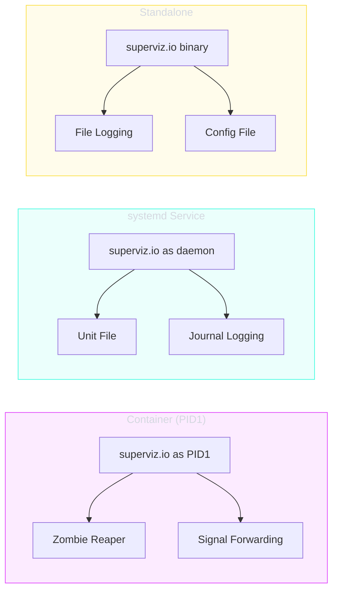

# Deployment

superviz.io is designed to run in multiple deployment scenarios: as PID1 in containers, as a systemd service, or as a standalone binary.

---

## Deployment Modes



| Mode | PID1 | Zombie Reaping | Signal Handling | Discovery |
|------|------|----------------|-----------------|-----------|
| [Container](container.md) | Yes | Automatic | Forward to children | Docker, K8s |
| [systemd](systemd.md) | No | By systemd | SIGTERM/SIGHUP | systemd, Docker |
| Standalone | No | No | SIGTERM/SIGHUP | All available |

---

## Binary Distribution

### Build from Source

```bash
cd src
go build -o supervizio ./cmd/daemon
```

### Cross-Compilation

```bash
# Linux AMD64
GOOS=linux GOARCH=amd64 CGO_ENABLED=1 go build -o supervizio-linux-amd64 ./cmd/daemon

# Linux ARM64
GOOS=linux GOARCH=arm64 CGO_ENABLED=1 go build -o supervizio-linux-arm64 ./cmd/daemon
```

CGO is required for the Rust probe library. Build the probe first:

```bash
make build-probe   # Builds libprobe.a
make build-daemon  # Builds Go binary with probe linked
```

---

## Supported Platforms

See [Platforms](platforms.md) for detailed cross-platform support.
