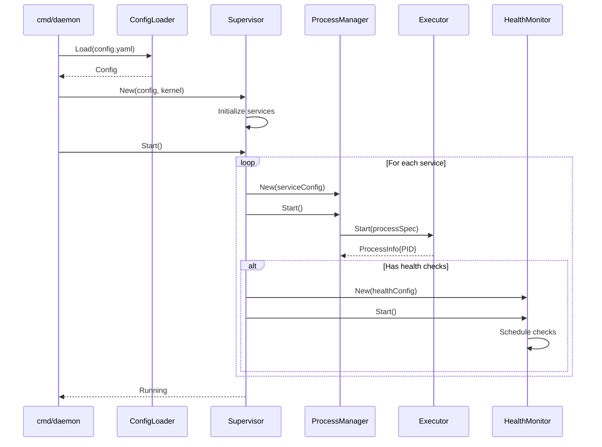
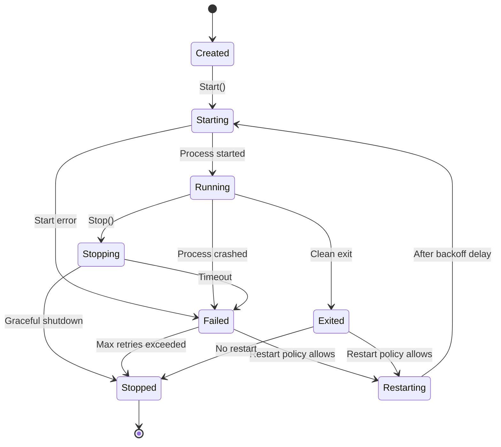
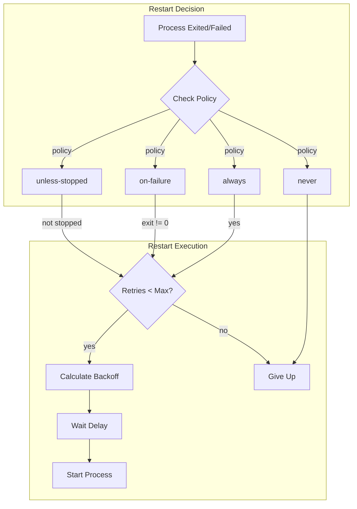
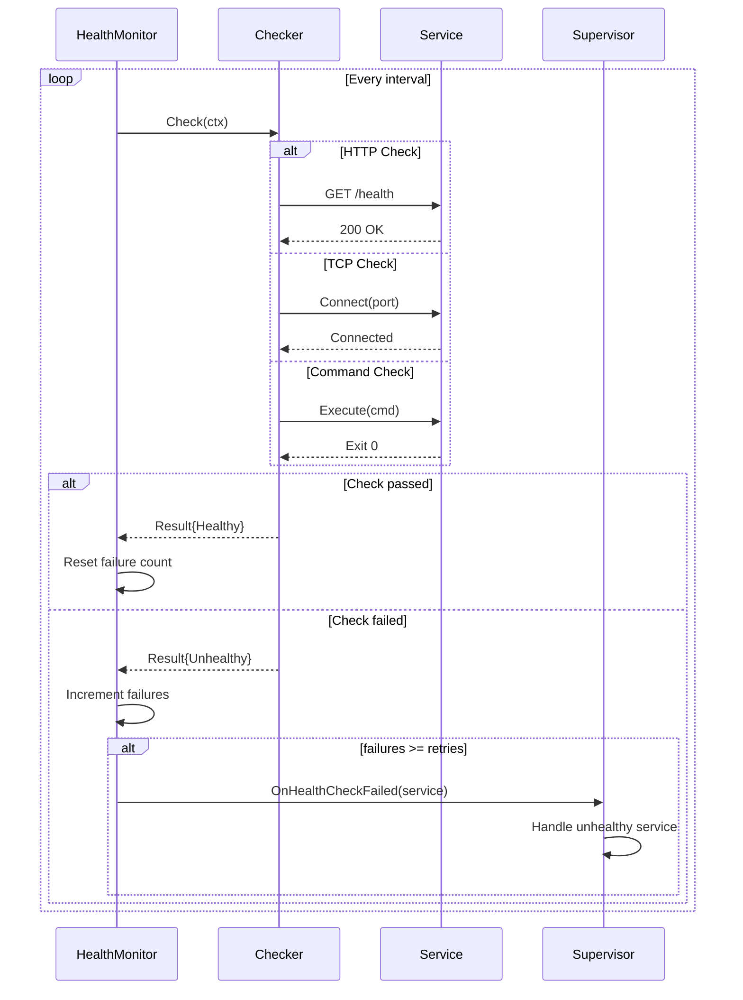
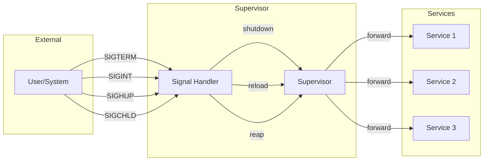
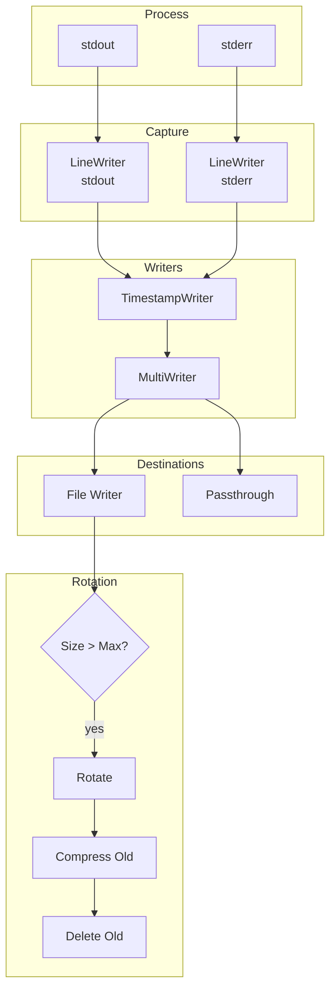

# Process Flows

This document describes the key process flows in superviz.io.

## Startup Flow



## Process Lifecycle

```
┌─────────────────────────────────────────────────────────────────────┐
│                        PROCESS LIFECYCLE                             │
└─────────────────────────────────────────────────────────────────────┘

                              ┌─────────┐
                              │ Created │
                              └────┬────┘
                                   │
                                   ▼
┌──────────────┐            ┌─────────────┐
│   Stopped    │◀───────────│  Starting   │
└──────────────┘   error    └──────┬──────┘
       ▲                           │ success
       │                           ▼
       │                    ┌─────────────┐
       │ stop signal        │   Running   │◀─────────┐
       │                    └──────┬──────┘          │
       │                           │                  │
       │              ┌────────────┼────────────┐    │
       │              │            │            │    │
       │              ▼            ▼            ▼    │
       │       ┌──────────┐ ┌──────────┐ ┌──────────┐│
       └───────│ Stopping │ │  Failed  │ │ Exited   ││
               └──────────┘ └────┬─────┘ └────┬─────┘│
                                 │            │      │
                                 │  restart?  │      │
                                 │            │      │
                                 ▼            ▼      │
                          ┌───────────────────────┐  │
                          │      Restarting       │──┘
                          │  (exponential backoff)│
                          └───────────────────────┘
```

### State Transitions



## Restart Logic



### Exponential Backoff

```
Initial delay: 5s (configurable)
Max delay: 5m (configurable)
Multiplier: 2x

Timeline:
  Attempt 1: Wait 5s  → Start
  Attempt 2: Wait 10s → Start
  Attempt 3: Wait 20s → Start
  Attempt 4: Wait 40s → Start
  Attempt 5: Wait 80s → Start
  Attempt 6: Wait 160s → Start
  Attempt 7: Wait 300s (max) → Start
  ...
```

## Health Check Flow



### Health Check Types

```
┌─────────────────────────────────────────────────────────────────────┐
│                        HEALTH CHECK TYPES                            │
└─────────────────────────────────────────────────────────────────────┘

HTTP Check                    TCP Check                  Command Check
───────────                   ─────────                  ─────────────

┌─────────┐                  ┌─────────┐                ┌─────────┐
│ Monitor │                  │ Monitor │                │ Monitor │
└────┬────┘                  └────┬────┘                └────┬────┘
     │                            │                          │
     │ GET /health                │ TCP Connect              │ Execute
     ▼                            ▼                          ▼
┌─────────┐                  ┌─────────┐                ┌─────────┐
│ Service │                  │ Service │                │  Shell  │
│ :8080   │                  │ :5432   │                │ Command │
└─────────┘                  └─────────┘                └─────────┘
     │                            │                          │
     │ 200 OK                     │ ACK                      │ Exit 0
     ▼                            ▼                          ▼
┌─────────┐                  ┌─────────┐                ┌─────────┐
│ Healthy │                  │ Healthy │                │ Healthy │
└─────────┘                  └─────────┘                └─────────┘
```

## Signal Handling Flow



### Signal Actions

```
┌──────────────────────────────────────────────────────────────────┐
│                       SIGNAL HANDLING                             │
├──────────────────────────────────────────────────────────────────┤
│                                                                   │
│  SIGTERM / SIGINT                                                │
│  ═══════════════                                                 │
│                                                                   │
│  1. Stop accepting new work                                      │
│  2. Send SIGTERM to all children                                 │
│  3. Wait for graceful shutdown (timeout)                         │
│  4. Send SIGKILL to remaining children                           │
│  5. Exit                                                         │
│                                                                   │
│  ┌─────────┐    SIGTERM    ┌─────────┐                          │
│  │Supervisor│─────────────▶│ Service │                          │
│  └─────────┘               └────┬────┘                          │
│       │                         │                                │
│       │ wait                    │ cleanup                        │
│       ▼                         ▼                                │
│  ┌─────────┐    if timeout ┌─────────┐                          │
│  │ Timeout │───────────────│ SIGKILL │                          │
│  └─────────┘               └─────────┘                          │
│                                                                   │
├──────────────────────────────────────────────────────────────────┤
│                                                                   │
│  SIGHUP                                                          │
│  ══════                                                          │
│                                                                   │
│  1. Re-read configuration file                                   │
│  2. Apply changes:                                               │
│     • New services: Start                                        │
│     • Removed services: Stop                                     │
│     • Modified services: Restart                                 │
│                                                                   │
│  ┌─────────┐    reload     ┌─────────┐    diff    ┌─────────┐   │
│  │ SIGHUP  │──────────────▶│ Config  │───────────▶│  Apply  │   │
│  └─────────┘               └─────────┘            └─────────┘   │
│                                                                   │
├──────────────────────────────────────────────────────────────────┤
│                                                                   │
│  SIGCHLD (PID 1 mode)                                            │
│  ════════════════════                                            │
│                                                                   │
│  1. Reap zombie process (waitpid)                                │
│  2. Check if it's a managed service                              │
│  3. If managed: Trigger restart logic                            │
│  4. If orphan: Just reap                                         │
│                                                                   │
│  ┌─────────┐    waitpid    ┌─────────┐   managed?  ┌─────────┐  │
│  │ SIGCHLD │──────────────▶│  Reap   │────────────▶│ Restart │  │
│  └─────────┘               └─────────┘             └─────────┘  │
│                                  │                               │
│                                  │ orphan                        │
│                                  ▼                               │
│                            ┌─────────┐                          │
│                            │ Discard │                          │
│                            └─────────┘                          │
│                                                                   │
└──────────────────────────────────────────────────────────────────┘
```

## Log Capture Flow



### Log Rotation Strategy

```
┌─────────────────────────────────────────────────────────────────────┐
│                        LOG ROTATION                                  │
└─────────────────────────────────────────────────────────────────────┘

Before Rotation:
    app.log (150MB) ← current, exceeds max_size (100MB)

After Rotation:
    app.log (0MB)     ← new file
    app.log.1 (150MB) ← previous
    app.log.2.gz      ← compressed
    app.log.3.gz      ← compressed
    [app.log.4.gz deleted - max_files=4]

Triggers:
    • max_size: Rotate when file exceeds size (e.g., 100MB)
    • max_age: Delete files older than duration (e.g., 7d)
    • max_files: Keep only N most recent files (e.g., 10)

Compression:
    • Old files compressed with gzip
    • Saves ~90% disk space
    • Transparent to log readers (zcat, zgrep)
```

## Complete Lifecycle Example

```
┌─────────────────────────────────────────────────────────────────────┐
│                    COMPLETE SERVICE LIFECYCLE                        │
└─────────────────────────────────────────────────────────────────────┘

Time     Event                          State
────     ─────                          ─────
t+0s     supervizio starts              Initializing
t+0.1s   Load config.yaml               Configuring
t+0.2s   Create Supervisor              Ready

t+0.3s   Start service "api"            api: Starting
t+0.5s   api process spawned (PID 123)  api: Running
t+1s     Start health monitor           api: Running (monitoring)

t+30s    Health check: GET /health      api: Running
t+30s    Response: 200 OK               api: Healthy

t+60s    Health check: GET /health      api: Running
t+60s    Response: 503 Error            api: Degraded (1/3 failures)

t+90s    Health check: GET /health      api: Degraded
t+90s    Response: 503 Error            api: Degraded (2/3 failures)

t+120s   Health check: GET /health      api: Degraded
t+120s   Response: 503 Error            api: Unhealthy (3/3 failures)
t+120s   Restart triggered              api: Restarting

t+125s   SIGTERM sent to PID 123        api: Stopping
t+126s   Process exited (exit 0)        api: Stopped
t+131s   Wait 5s (backoff delay)        api: Waiting
t+131s   Start new process (PID 456)    api: Starting
t+132s   Process running                api: Running

t+162s   Health check: GET /health      api: Running
t+162s   Response: 200 OK               api: Healthy

...

t+3600s  SIGTERM received               Shutting down
t+3600s  Stop all services              api: Stopping
t+3601s  api exited cleanly             api: Stopped
t+3601s  supervizio exits               Terminated
```
