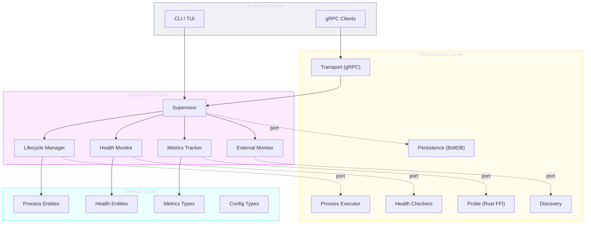

<!-- docs-generation: 2026-02-08 full -->
# superviz.io

**PID1-capable process supervisor for containers and Unix systems.**

superviz.io is a lightweight, cross-platform process supervisor written in Go with a Rust-based system metrics probe. It manages service lifecycles, monitors health, collects metrics, and exposes a gRPC streaming API --- all designed to run as PID1 in containers or as a standalone daemon.

---

## Features

| Feature | Description |
|---------|-------------|
| **Process Supervision** | Start, stop, restart services with configurable policies |
| **PID1 Mode** | Zombie process reaping, signal forwarding for containers |
| **Health Probing** | TCP, HTTP, gRPC, ICMP, UDP, exec-based health checks |
| **System Metrics** | CPU, memory, disk, network, I/O via Rust FFI probe |
| **Resource Quotas** | cgroups v1/v2 (Linux), getrlimit (macOS/BSD), rctl (FreeBSD) |
| **Service Discovery** | Docker, Podman, systemd, OpenRC, BSD rc, Kubernetes, Nomad |
| **gRPC API** | Unary and streaming RPCs for state, processes, and metrics |
| **Terminal UI** | Raw mode (MOTD banner) and interactive mode (1Hz real-time) |
| **YAML Configuration** | Declarative service and monitoring definitions |
| **Cross-Platform** | Linux (amd64/arm64), macOS, FreeBSD, OpenBSD, NetBSD |

---

## Architecture

superviz.io follows **hexagonal architecture** (ports & adapters) with domain-driven design:



---

## Quick Start

```bash
# Build from source
cd src && go build ./cmd/daemon

# Run with a configuration file
./daemon --config /etc/supervizio/config.yaml

# Run with interactive TUI
./daemon --config config.yaml --tui
```

Minimal configuration:

```yaml
version: "1"

services:
  - name: my-app
    command: /usr/local/bin/my-app
    restart:
      policy: on-failure
      max_retries: 5
      delay: 5s
```

---

## gRPC API

Two services with 10 RPCs including server-side streaming:

| Service | RPC | Type |
|---------|-----|------|
| `DaemonService` | `GetState` | Unary |
| `DaemonService` | `StreamState` | Server streaming |
| `DaemonService` | `ListProcesses` | Unary |
| `DaemonService` | `GetProcess` | Unary |
| `DaemonService` | `StreamProcessMetrics` | Server streaming |
| `MetricsService` | `GetSystemMetrics` | Unary |
| `MetricsService` | `StreamSystemMetrics` | Server streaming |
| `MetricsService` | `StreamProcessMetrics` | Server streaming |
| `MetricsService` | `StreamAllProcessMetrics` | Server streaming |
| `Health` | `Check` | Unary |

---

## Platform Support

| Platform | Supervision | Metrics | Quotas | Discovery |
|----------|------------|---------|--------|-----------|
| Linux amd64/arm64 | Full | Full | cgroups v1/v2 | Docker, Podman, systemd, OpenRC, K8s, Nomad |
| macOS amd64/arm64 | Full | Partial | getrlimit | Docker, Podman |
| FreeBSD amd64 | Full | Partial | rctl | BSD rc |
| OpenBSD amd64 | Full | Partial | getrlimit | BSD rc |
| NetBSD amd64 | Full | Partial | getrlimit | BSD rc |

---

## Documentation

- [Architecture](architecture/index.md) --- Hexagonal design, C4 diagrams, data flow
- [API Reference](api/index.md) --- gRPC service definitions and message types
- [Configuration](configuration/index.md) --- YAML format, services, monitoring
- [Components](components/supervisor.md) --- Supervisor, lifecycle, health, metrics, discovery, TUI
- [Deployment](deployment/index.md) --- Container PID1, systemd, cross-platform
- [Guides](guides/getting-started.md) --- Getting started, development setup
